# Лабораторная работа №2. Введение в WordPress

**Студент:** Zabudico Alexandr
**Дата выполнения:** 15.03.2026  
**Цель работы:** Научиться устанавливать WordPress в локальной среде, осваивать админ-панель, изменять внешний вид сайта через темы и расширять его функциональность с помощью плагинов.


---

## Содержание

1. [Шаг 1. Подготовка среды](#шаг-1-подготовка-среды)
2. [Шаг 2. Установка WordPress](#шаг-2-установка-wordpress)
3. [Шаг 3. Первоначальные настройки сайта](#шаг-3-первоначальные-настройки-сайта)
4. [Шаг 4. Работа с темами](#шаг-4-работа-с-темами)
5. [Шаг 5. Работа с плагинами](#шаг-5-работа-с-плагинами)
6. [Шаг 6. Создание контента](#шаг-6-создание-контента)
7. [Ответы на контрольные вопросы](#ответы-на-контрольные-вопросы)
8. [Вывод](#вывод)

---

## Шаг 1. Подготовка среды

### Описание

Для развёртывания WordPress в локальной среде был использован стек **XAMPP v3.3.0** (Apache Friends), включающий веб-сервер Apache, базу данных MariaDB, интерпретатор PHP и Perl. XAMPP предоставляет готовую среду разработки без необходимости отдельной установки и настройки каждого компонента.

**Выполненные действия:**

1. Запущен **XAMPP Control Panel v3.3.0**.
2. Активированы модули **Apache** (порты 443 и 8080) и **MySQL** (порт 3306).
3. Проверена доступность локального сервера — в браузере открыт `http://localhost:8080`, успешно загрузилась стартовая страница XAMPP.
4. В **phpMyAdmin** (`http://localhost:8080/phpmyadmin`) создана новая база данных **wp_lab2** с кодировкой `utf8mb4_general_ci`.

### Скриншоты

**Рисунок 1 — Панель управления XAMPP: модули Apache и MySQL запущены**

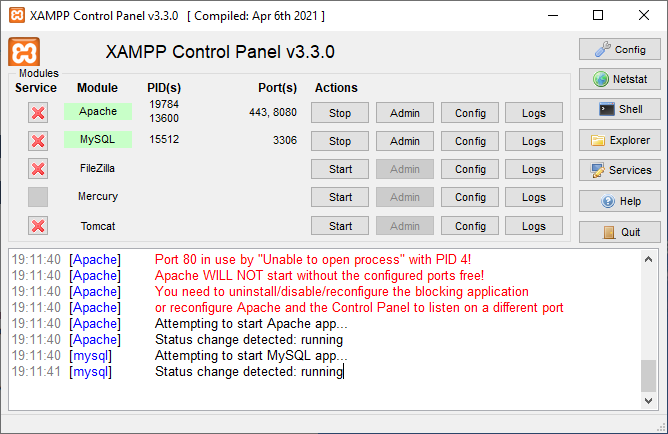

**Рисунок 2 — Стартовая страница XAMPP по адресу http://localhost:8080**

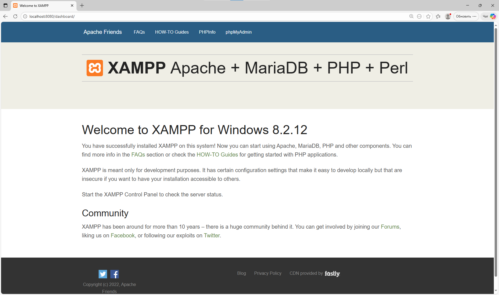

**Рисунок 3 — phpMyAdmin: создание базы данных wp_lab2**

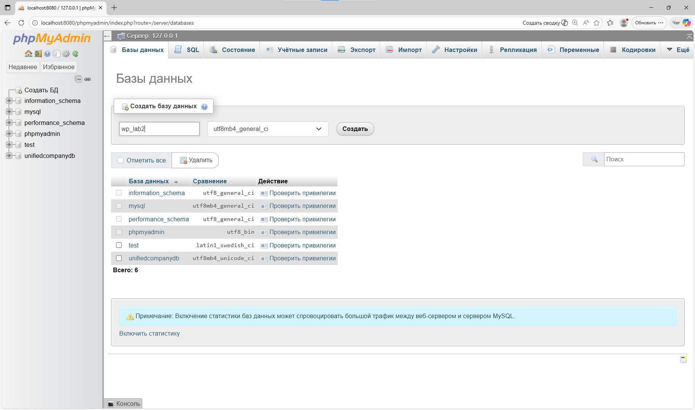

---

## Шаг 2. Установка WordPress

### Описание

WordPress был скачан с официального сайта [wordpress.org](https://wordpress.org) и распакован в директорию `htdocs/wp_lab2/wordpress` внутри папки XAMPP. Установка выполнялась через встроенный мастер в браузере.

**Выполненные действия:**

1. Архив WordPress распакован в `C:\xampp\htdocs\wp_lab2\wordpress`.
2. В браузере открыт адрес `http://localhost:8080/wp_lab2/wordpress`, выбран язык — **Русский**.
3. Заполнены данные подключения к базе данных:
   - Имя базы данных: `wp_lab2`
   - Имя пользователя: `admin`
   - Пароль: пароль пользователя БД
   - Сервер базы данных: `localhost`
   - Префикс таблиц: `wp_`
4. Заполнены данные сайта: название `dodo`, имя пользователя `travor038`, email `travor038@gmail.com`.
5. Нажата кнопка **«Установить WordPress»** — установка завершена успешно.

### Скриншоты

**Рисунок 4 — Мастер установки WordPress: настройка подключения к базе данных**

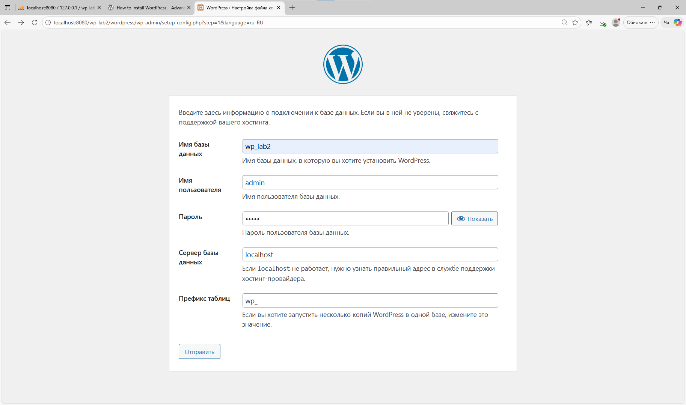

**Рисунок 5 — Мастер установки WordPress: ввод данных сайта и администратора**

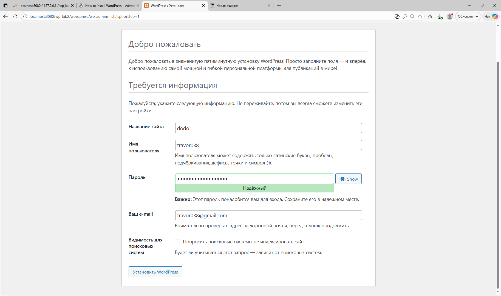

**Рисунок 6 — Успешное завершение установки WordPress**

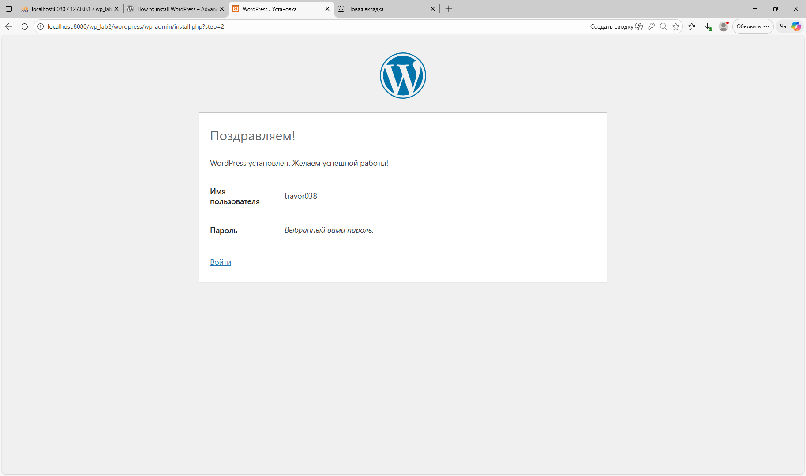

**Рисунок 7 — Страница входа в административную панель WordPress**

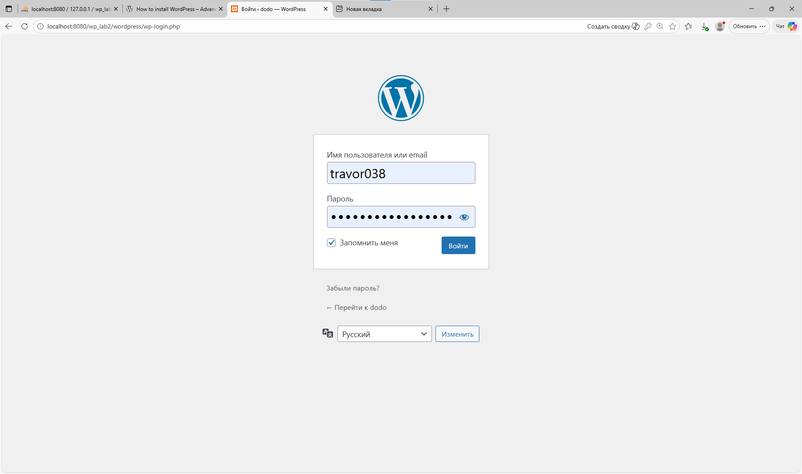

---

## Шаг 3. Первоначальные настройки сайта

### Описание

После входа в административную панель выполнены базовые настройки сайта: изменено название, установлен часовой пояс, настроена структура постоянных ссылок.

### 3.1 Настройки → Общие (Settings → General)

**Выполненные действия:**

1. В левом меню выбрано **Настройки → Общие**.
2. Название сайта изменено на **MyDodo**.
3. Часовой пояс установлен на **UTC+2** (Кишинёв, Молдова).
4. Нажата кнопка **«Сохранить изменения»** — появилось подтверждение «Настройки сохранены».

### Скриншоты

**Рисунок 8 — Общие настройки: изменено название сайта на MyDodo**

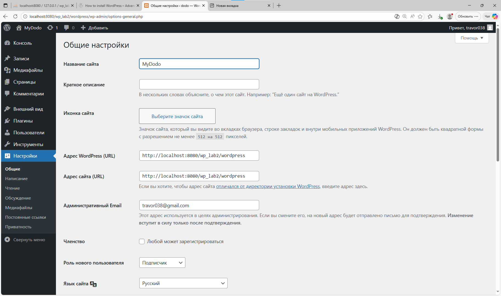

**Рисунок 9 — Общие настройки: установка часового пояса**

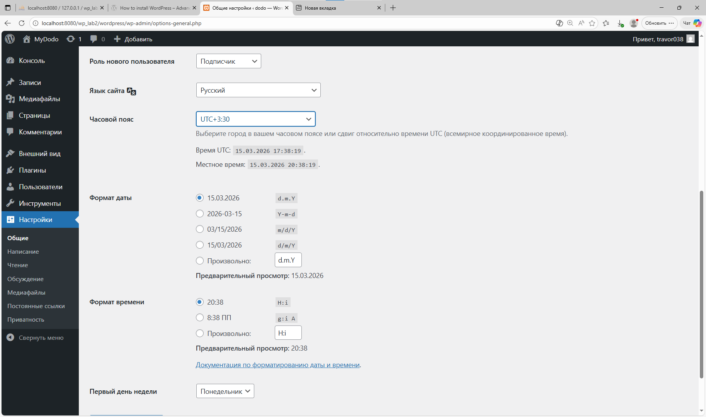

**Рисунок 10 — Общие настройки: часовой пояс UTC+2, настройки сохранены**

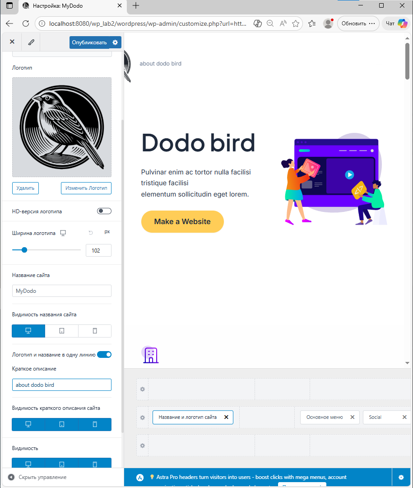

**Рисунок 11 — Подтверждение сохранения общих настроек**

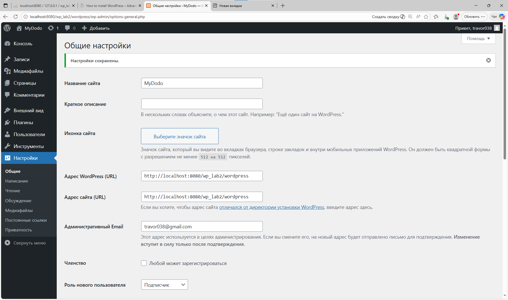

### 3.2 Настройки → Постоянные ссылки (Settings → Permalinks)

**Выполненные действия:**

1. В левом меню выбрано **Настройки → Постоянные ссылки**.
2. Выбран вариант **«Название записи»** (Post name) — ссылки принимают вид `/название-записи/` вместо нечитаемого `/?p=123`.
3. Нажата кнопка **«Сохранить изменения»** — появилось сообщение «Структура постоянных ссылок изменена».

**Рисунок 12 — Постоянные ссылки: выбран вариант «Название записи», изменения сохранены**

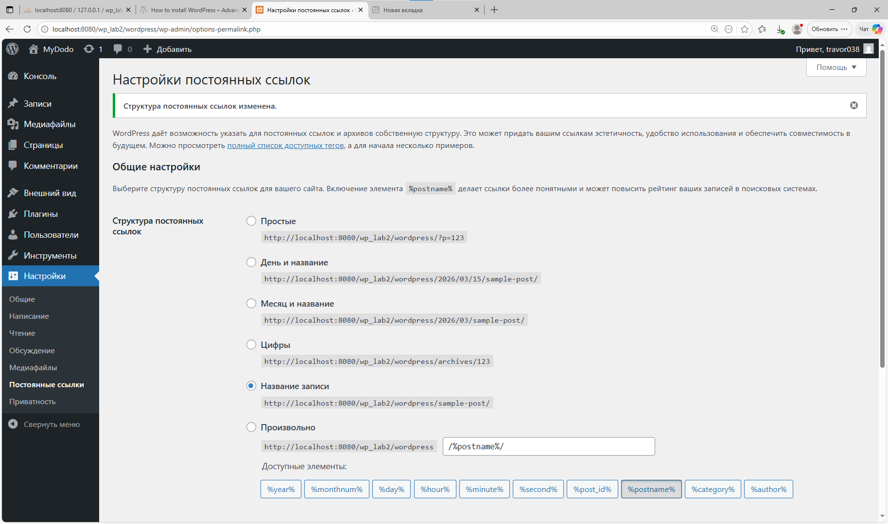

---

## Шаг 4. Работа с темами

### Описание

WordPress по умолчанию поставляется со стандартной темой. В рамках данного шага установлена популярная тема **Astra** из официального каталога, проведено сравнение внешнего вида до и после смены, а также выполнена настройка через инструмент кастомизации.

### 4.1 Установка и активация темы Astra

**Выполненные действия:**

1. В меню выбрано **Внешний вид → Темы → Добавить новую**.
2. В поиске найдена тема **Astra** (автор: Brainstorm Force, версия 4.12.4, более 1 млн установок).
3. Нажата кнопка **«Установить»**, затем **«Активировать»**.
4. Внешний вид сайта изменился — в футере появилась надпись «Powered by Тема Astra WordPress».

### Скриншоты

**Рисунок 13 — Каталог тем: страница темы Astra перед установкой**


**Рисунок 14 — Сайт ДО смены темы (стандартная тема WordPress)**

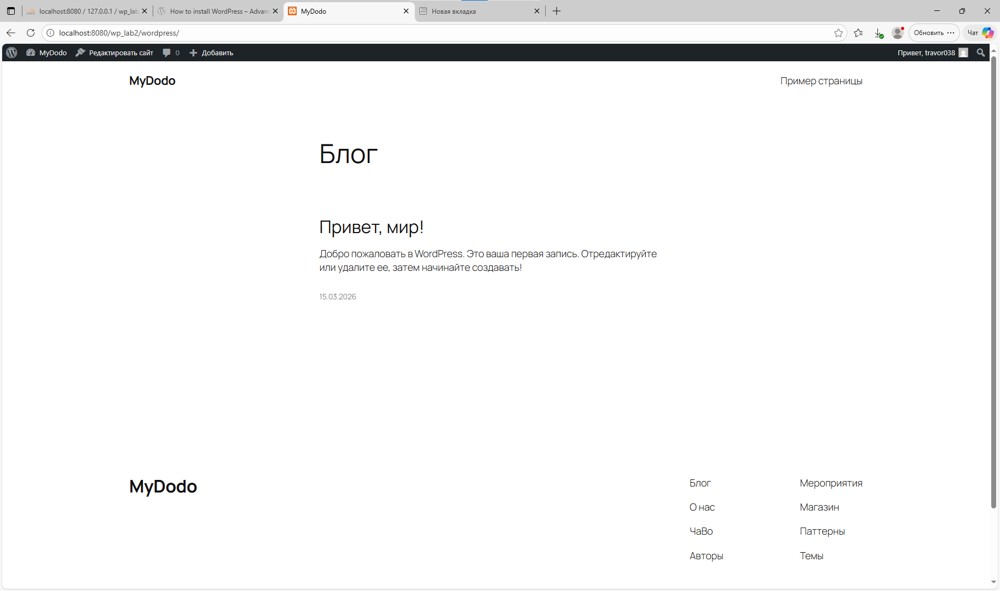

**Рисунок 15 — Сайт ПОСЛЕ активации темы Astra**

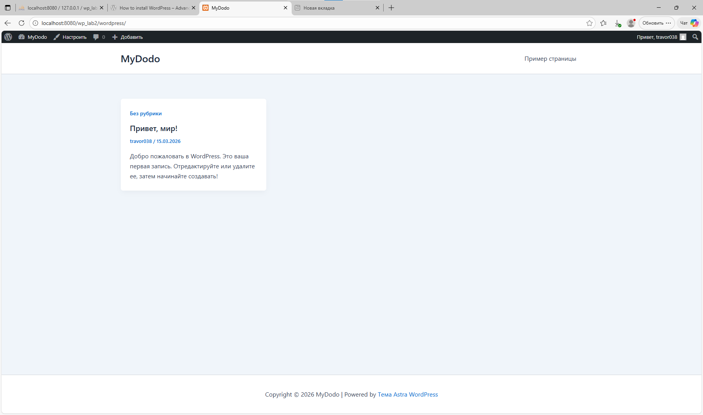

### 4.2 Настройка темы через Customize (Внешний вид → Настроить)

**Выполненные действия:**

1. В меню выбрано **Внешний вид → Настроить**.
2. Загружен **логотип сайта** — чёрно-белая иллюстрация птицы додо, ширина 102px.
3. Установлено **краткое описание**: `about dodo bird`.
4. Настроена **цветовая схема** — основной акцентный цвет изменён на жёлтый.
5. Включена опция «Логотип и название в одну линию».
6. Нажата кнопка **«Опубликовать»** — изменения сохранены.

**Рисунок 16 — Customize: настройка логотипа, названия и описания сайта (десктоп)**

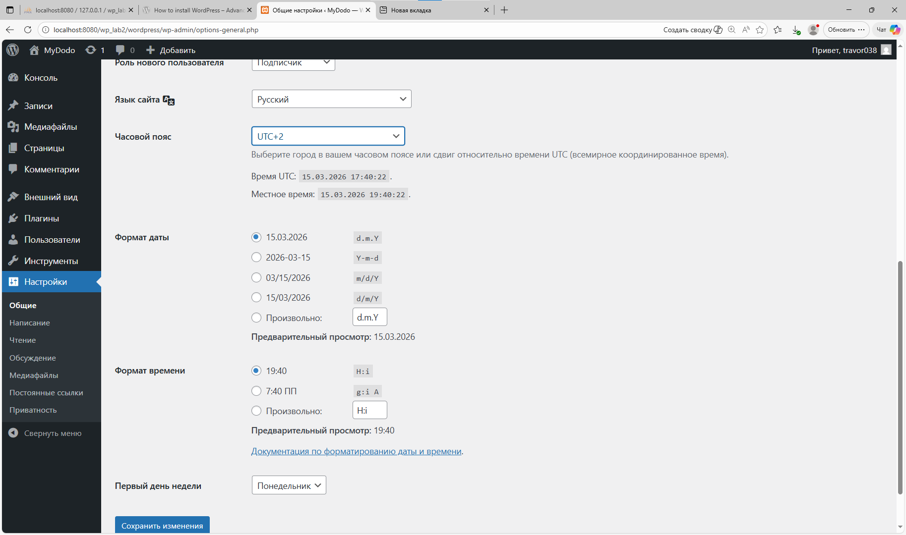

**Рисунок 17 — Customize: предпросмотр изменений (мобильное представление)**

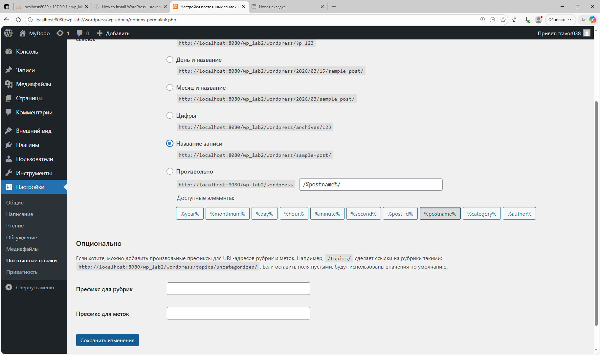

**Рисунок 18 — Итоговый вид сайта после настройки: логотип, название MyDodo, меню навигации**

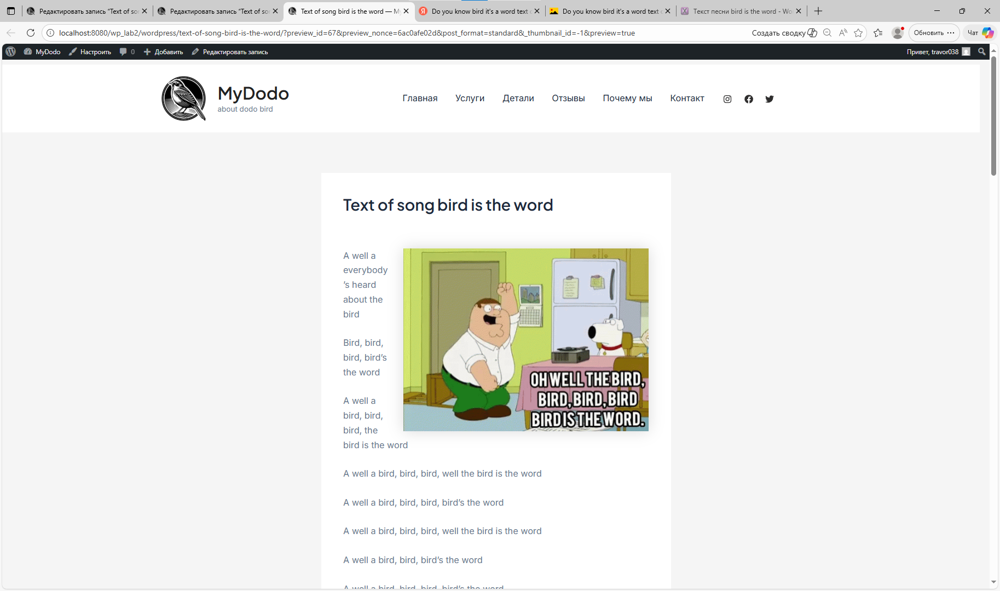

---

## Шаг 5. Работа с плагинами

### Описание

Плагины расширяют функциональность WordPress без изменения кода ядра. В данном шаге установлены и протестированы плагины **Classic Editor** и **Contact Form 7**, а также продемонстрировано исчезновение функций при деактивации плагина.

### 5.1 Установка Classic Editor

**Выполненные действия:**

1. В меню выбрано **Плагины → Добавить новый**.
2. В поиске введено **Classic Editor** — плагин установлен и активирован (версия 1.6.7).
3. **Проверка:** в разделе **Записи → Добавить новую** открылся классический редактор TinyMCE с панелью инструментов (Bold, Italic, списки, вставка медиафайлов) вместо блочного редактора Gutenberg.

### 5.2 Установка Contact Form 7

**Выполненные действия:**

1. В меню выбрано **Плагины → Добавить новый**.
2. В поиске введено **Contact Form 7** — плагин установлен и активирован (версия 6.1.5).
3. В левом меню появился новый раздел **«Contact Form 7»**.
4. Автоматически создана «Контактная форма 1» с шорткодом:

```
[contact-form-7 id="ddf128c" title="контактная форма 1"]
```

### 5.3 Деактивация плагина и проверка исчезновения функций

**Выполненные действия:**

1. Открыт раздел **Плагины → Установленные плагины**.
2. Плагин **Hello Dolly** деактивирован — нажата кнопка «Деактивировать».
3. Результат: строка из песни, которая ранее отображалась в правом верхнем углу админ-панели, исчезла. На скриншоте (Рисунок 20) видно, что Hello Dolly имеет статус «Неактивный» — доступна только кнопка «Активировать», что подтверждает: при деактивации плагина все его функции немедленно отключаются.

### Скриншоты

**Рисунок 19 — Classic Editor: создание записи с классическим редактором TinyMCE**

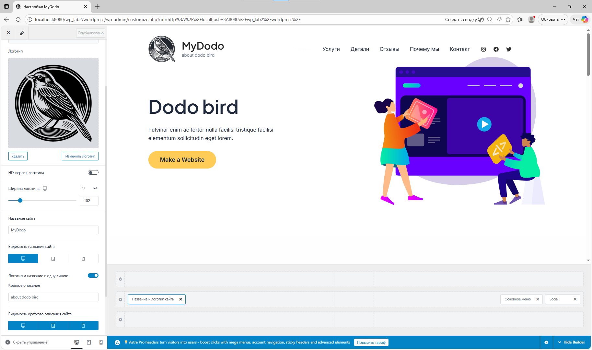

**Рисунок 20 — Установленные плагины: Classic Editor и Contact Form 7 активны; Hello Dolly деактивирован**

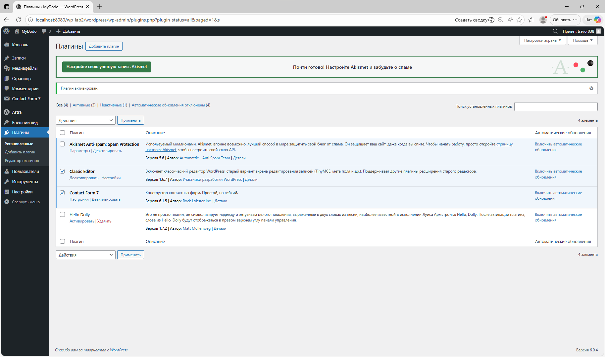

**Рисунок 21 — Contact Form 7: список контактных форм с шорткодом**

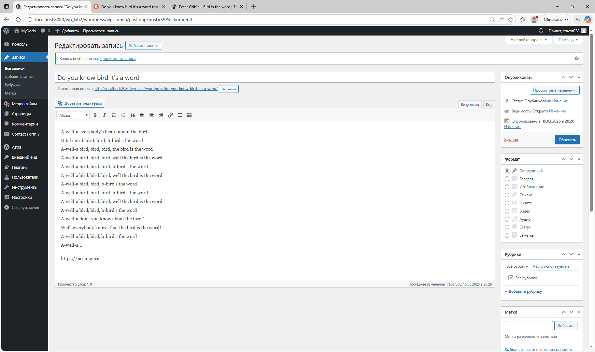

---

## Шаг 6. Создание контента

### Описание

Создана страница «Контакты» с встроенной формой обратной связи, а также несколько записей блога с текстовым и медиаконтентом. Проверено отображение контента на сайте.

### 6.1 Страница «Контакты»

**Выполненные действия:**

1. В меню выбрано **Страницы → Добавить новую**.
2. Введён заголовок **«Контакты»**.
3. В тело страницы вставлен шорткод Contact Form 7:

```
[contact-form-7 id="ddf128c" title="контактная форма 1"]
```

4. Нажата кнопка **«Опубликовать»** — страница доступна по адресу `http://localhost:8080/wp_lab2/wordpress/контакты/`.
5. Открыт предпросмотр — форма корректно отображает поля: «Ваше имя», «Ваш e-mail», «Тема», «Ваше сообщение» и кнопку «Отправить».

### Скриншоты

**Рисунок 22 — Редактор: страница «Контакты» со вставленным шорткодом, опубликована**

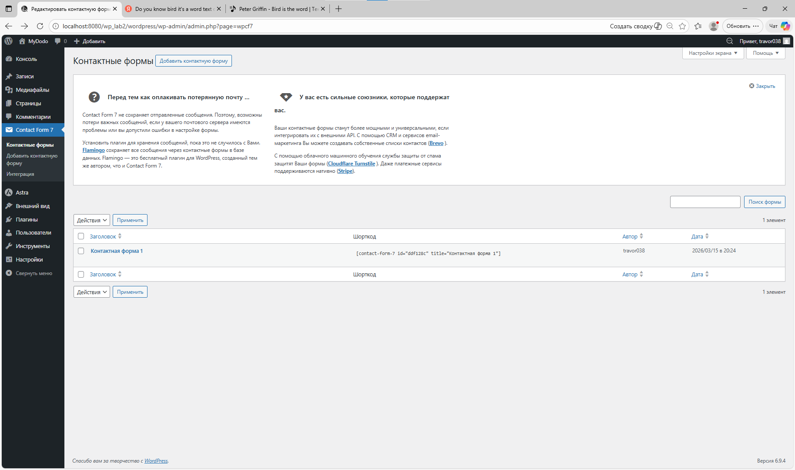

**Рисунок 23 — Фронтенд: страница «Контакты» с формой обратной связи**

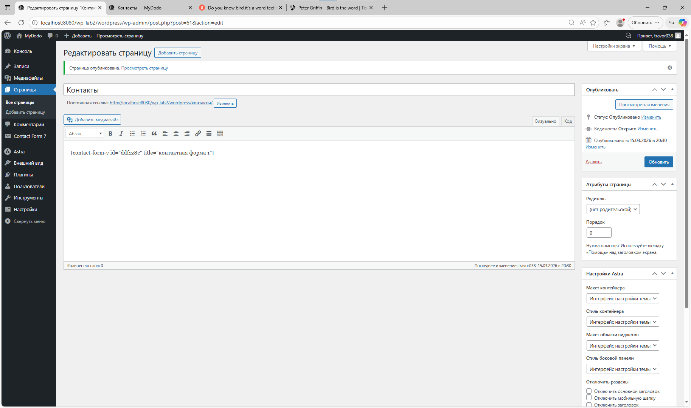

### 6.2 Записи блога

**Выполненные действия:**

Создано три записи в блоге с разным контентом:

1. **«Do you know bird it's a word»** — текстовая запись, созданная через Classic Editor.
2. **«Text of song bird is the word»** — запись с текстовым контентом и прикреплённым изображением (добавлено через кнопку «Добавить медиафайл»).
3. **«Bird»** — запись с объёмным текстовым контентом и изображением.

Все записи опубликованы и отображаются на сайте. Ссылки имеют читаемый вид `/do-you-know-bird-its-a-word/`, `/bird/` благодаря настройке Permalinks из шага 3.

### Скриншоты

**Рисунок 24 — Запись «Do you know bird it's a word» на сайте**

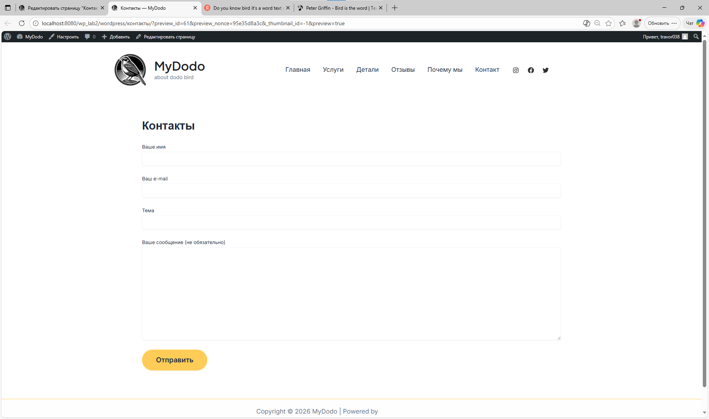

**Рисунок 25 — Запись «Text of song bird is the word» с изображением**

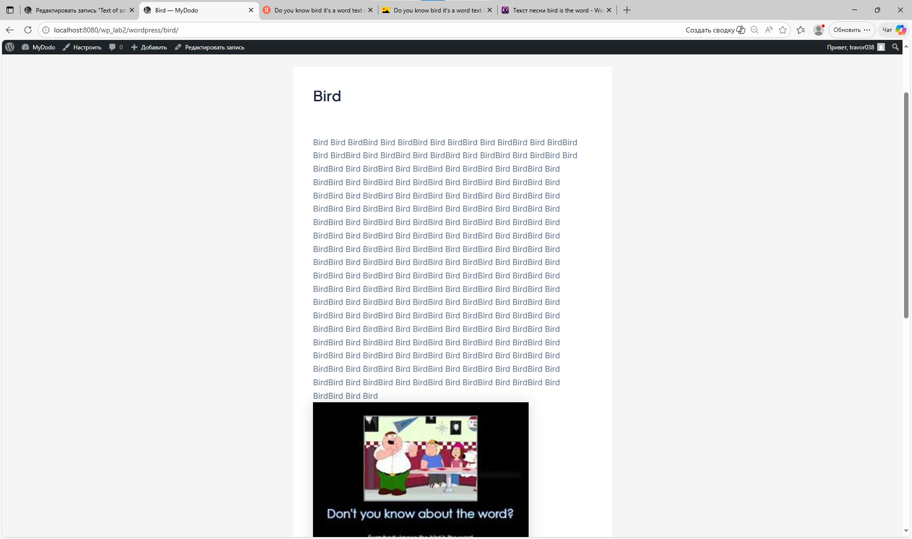

**Рисунок 26 — Запись «Bird» с текстовым контентом и изображением**

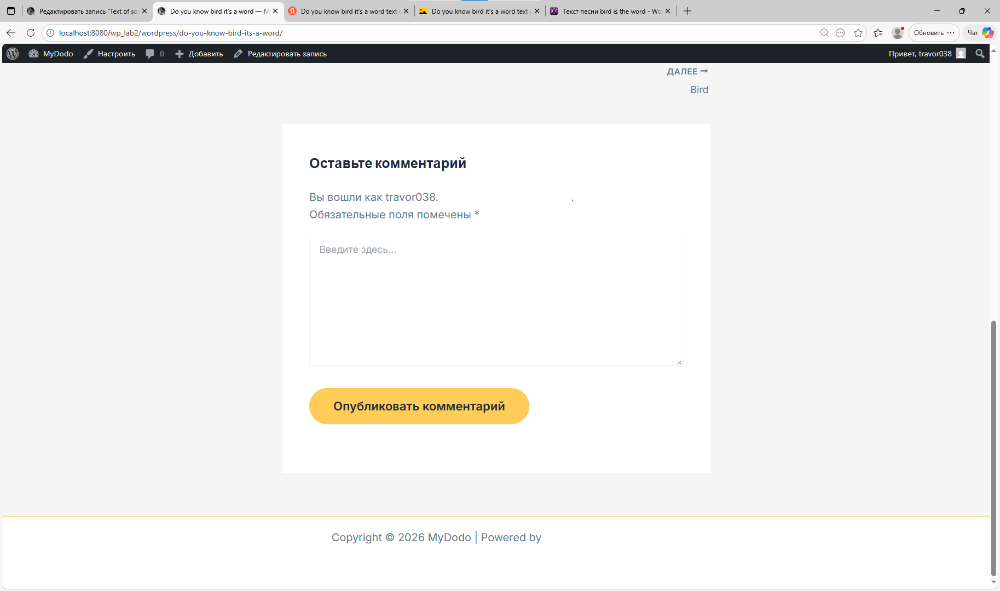

**Рисунок 27 — Секция комментариев под записью блога**

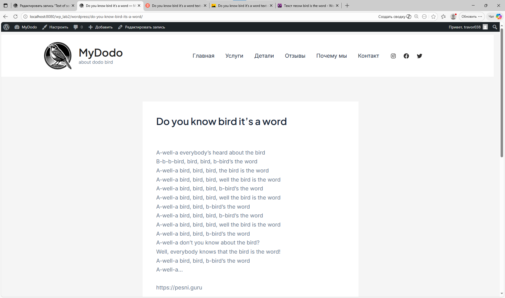

---

## Ответы на контрольные вопросы

### 1. Что делает тема в WordPress, а что — плагин?

**Тема** отвечает исключительно за **внешний вид** сайта: дизайн, шрифты, цветовую схему, расположение элементов (шапка, футер, сайдбар), шаблоны страниц и записей. Тема определяет, *как выглядит* контент, но не добавляет новой функциональности. В данной работе тема Astra задала визуальный стиль, логотип, навигацию и типографику.

**Плагин** расширяет **функциональность** WordPress: добавляет новые возможности, отсутствующие в базовой установке — формы обратной связи, SEO-инструменты, галереи, интернет-магазины и т.д. Плагин определяет, *что умеет делать* сайт. В работе Classic Editor вернул классический интерфейс редактирования, а Contact Form 7 добавил конструктор контактных форм.

**Ключевое различие:** тема = оформление, плагин = функциональность. Они независимы и могут комбинироваться в любых сочетаниях.

### 2. Почему при смене темы контент сайта не теряется?

Потому что в архитектуре WordPress **контент и оформление полностью разделены**. Все записи, страницы, комментарии, медиафайлы и настройки хранятся в **базе данных MySQL** независимо от активной темы. Тема представляет собой лишь набор PHP-шаблонов и CSS-стилей — она определяет *способ отображения* данных, но не хранит сами данные.

При смене темы WordPress начинает использовать другой набор шаблонов для визуализации тех же данных из базы. Это было наглядно продемонстрировано в ходе работы: после активации темы Astra вместо стандартной темы все ранее созданные записи по-прежнему отображались на сайте — изменился только их внешний вид.

### 3. Как можно изменить внешний вид сайта без редактирования кода?

В WordPress доступно несколько способов изменить внешний вид без написания кода:

1. **Appearance → Customize (Внешний вид → Настроить)** — встроенный визуальный редактор с предпросмотром в реальном времени. Позволяет менять логотип, цветовую схему, шрифты, заголовок, описание, меню и виджеты. Именно этот инструмент использовался в данной работе при настройке темы Astra.

2. **Смена темы** — установка другой готовой темы из официального каталога WordPress (более 10 000 бесплатных тем) полностью меняет облик сайта одним действием без риска потери контента.

3. **Плагины-конструкторы страниц** (Page Builders) — Elementor, Beaver Builder и другие. Это визуальные редакторы с принципом drag-and-drop для создания сложных макетов без знания HTML и CSS.

4. **Управление меню и виджетами** — через **Внешний вид → Меню** и **Внешний вид → Виджеты** можно управлять структурой навигации и боковых панелей.

---

## Вывод

В ходе выполнения лабораторной работы была освоена полная процедура развёртывания CMS WordPress в локальной среде с использованием стека XAMPP. Изучены основные разделы административной панели, принципы разделения контента и оформления, работа с темами и плагинами.

**Ключевые результаты:**
- Установлен и настроен локальный веб-сервер XAMPP (Apache + MySQL)
- Создана база данных и выполнена полная установка WordPress
- Настроены параметры сайта: название (MyDodo), часовой пояс (UTC+2), постоянные ссылки (Post name)
- Установлена и настроена тема Astra: логотип, описание, цветовая схема
- Установлены и протестированы плагины Classic Editor и Contact Form 7
- Создана страница «Контакты» с формой обратной связи через шорткод
- Созданы три записи блога с текстовым и медиаконтентом
- Продемонстрировано исчезновение функций при деактивации плагина (Hello Dolly)

Практическая работа подтвердила ключевое преимущество WordPress: независимое хранение контента в базе данных позволяет свободно менять внешний вид без риска потери данных, а система плагинов обеспечивает гибкое расширение функциональности без написания кода.
