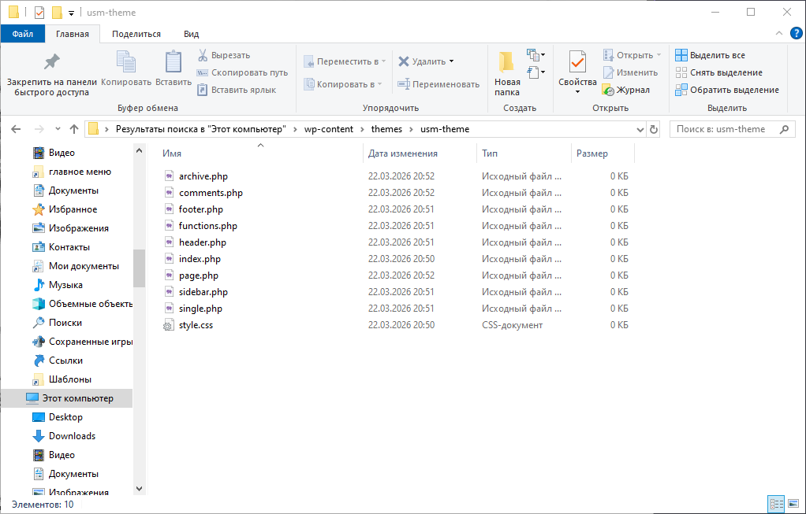
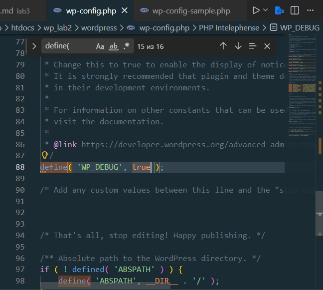
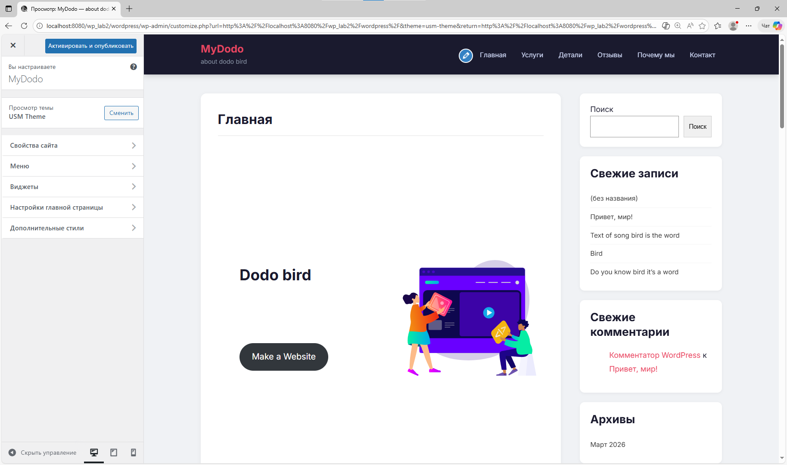
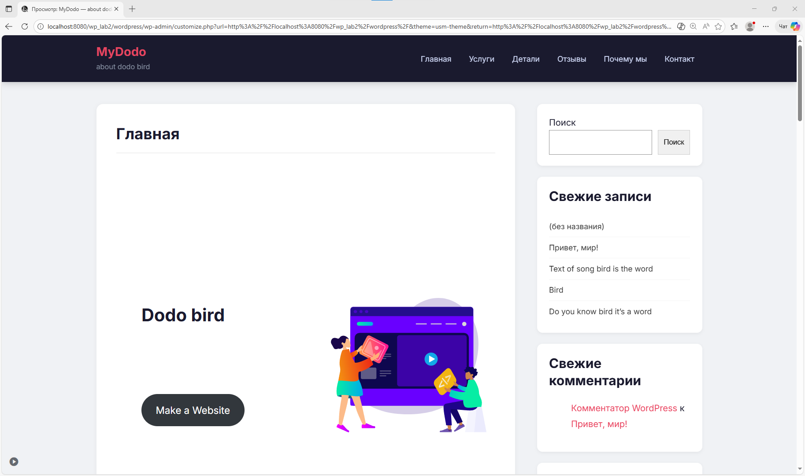
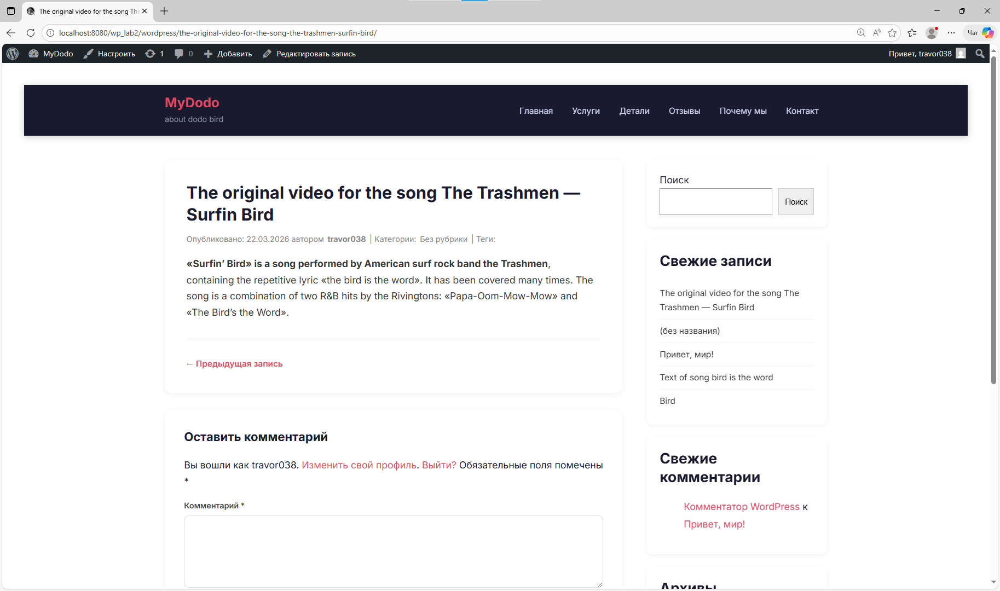
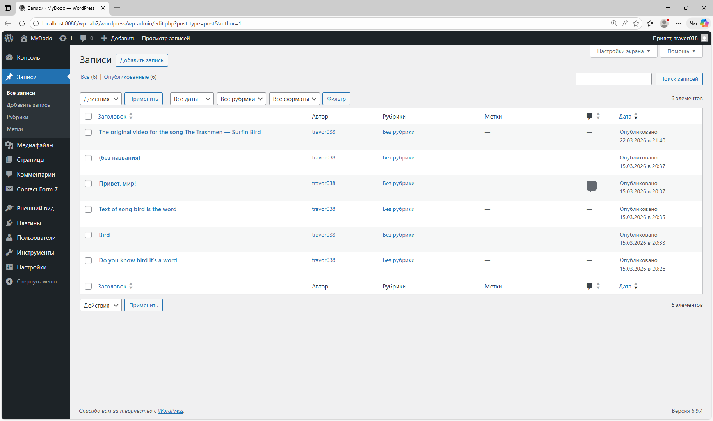
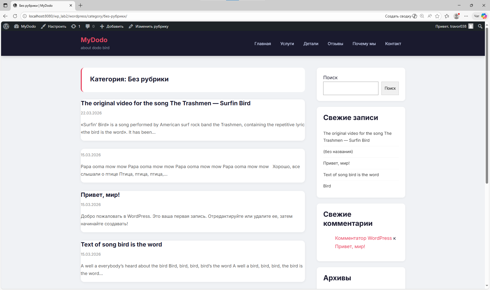

# Лабораторная работа №3. Разработка простой темы WordPress

**Факультет:** Математики и Информатики, USM  
**Дисциплина:** Content Management Systems  
**Дата сдачи:** 22 марта 2026  
**Автор:** Zabudico Alexandr  
**Репозиторий:** [https://github.com/zabudico/usm-theme](https://github.com/zabudico/usm-theme)

---

## Содержание

1. [Описание лабораторной работы](#описание-лабораторной-работы)
2. [Инструкции по запуску проекта](#инструкции-по-запуску-проекта)
3. [Теоретическая часть](#теоретическая-часть)
4. [Практическая часть — особенности реализации](#практическая-часть--особенности-реализации)
5. [Краткая документация к теме](#краткая-документация-к-теме)
6. [Примеры использования темы](#примеры-использования-темы)
7. [Ответы на контрольные вопросы](#ответы-на-контрольные-вопросы)
8. [Вывод](#вывод)
9. [Список использованных источников](#список-использованных-источников)

---

## Описание лабораторной работы

**Цель:** Научиться создавать собственную тему WordPress, разобраться в её минимальной структуре и принципах работы шаблонов.

В ходе работы была разработана WordPress-тема `usm-theme` с нуля. Тема включает все обязательные и дополнительные шаблоны, подключение стилей через `functions.php`, а также корректную иерархию файлов согласно стандартам WordPress.

---

## Инструкции по запуску проекта

### Требования

- PHP 7.4 или выше
- MySQL 5.7 / MariaDB 10.3 или выше
- WordPress 6.x (локальная установка: [LocalWP](https://localwp.com/), XAMPP или аналог)

### Установка темы

1. Клонировать репозиторий:
   ```bash
   git clone https://github.com/zabudico/usm-theme.git
   ```

2. Скопировать папку `usm-theme` в директорию WordPress:
   ```
   wp-content/themes/usm-theme/
   ```

3. В файле `wp-config.php` включить режим отладки:
   ```php
   define('WP_DEBUG', true);
   define('WP_DEBUG_LOG', true);
   define('WP_DEBUG_DISPLAY', true);
   ```

4. В админ-панели перейти в **Appearance → Themes**, найти **USM Theme** и нажать **Activate**.

5. В **Settings → Reading** выбрать **Your latest posts** — чтобы главная страница выводила записи через `index.php`.

### Структура репозитория

```
lab3/
├── img/                    # Скриншоты для отчёта
│   ├── wp_lab3_1.png       # Главная страница сайта
│   ├── wp_lab3_2.png       # Папка themes с usm-theme
│   ├── wp_lab3_3.png       # WP_DEBUG в wp-config.php
│   ├── wp_lab3_4.png       # Файлы папки usm-theme
│   ├── wp_lab3_5.png       # Тема в Appearance → Themes
│   ├── wp_lab3_6.png       # Внешний вид сайта
│   ├── wp_lab3_7.png       # Страница поста (single.php)
│   └── wp_lab3_8.png       # Страница архива (archive.php)
├── usm-theme/              # Файлы темы WordPress
│   ├── archive.php
│   ├── comments.php
│   ├── footer.php
│   ├── functions.php
│   ├── header.php
│   ├── index.php
│   ├── page.php
│   ├── sidebar.php
│   ├── single.php
│   ├── style.css
│   └── screenshot.png      # Превью темы 1200×900
└── README.md               # Данный отчёт
```

---

## Теоретическая часть

### Что такое тема WordPress?

Тема WordPress — это набор файлов-шаблонов (PHP, CSS, JS), которые определяют внешний вид и структуру сайта. WordPress использует систему иерархии шаблонов: при запросе определённого типа контента движок ищет наиболее подходящий файл-шаблон по фиксированному порядку.

### Обязательные файлы темы

| Файл | Назначение |
|---|---|
| `style.css` | Метаданные темы (название, версия, автор и др.) |
| `index.php` | Главный резервный шаблон |

Без `style.css` с корректными метаданными WordPress не распознает тему. Без `index.php` тема вызовет ошибку при активации.

### Иерархия шаблонов WordPress

```
Запрос к сайту
│
├─ Пост?      → single.php   → index.php
├─ Страница?  → page.php     → index.php
├─ Архив?     → archive.php  → index.php
└─ Главная?   → front-page.php → home.php → index.php
```

### Роль functions.php

Файл `functions.php` загружается WordPress автоматически при каждом запросе и позволяет:
- подключать стили через `wp_enqueue_style()`
- регистрировать меню через `register_nav_menus()`
- регистрировать сайдбары через `register_sidebar()`
- добавлять поддержку функций через `add_theme_support()`
- добавлять пользовательские хуки и фильтры

---

## Практическая часть — особенности реализации

### Шаг 1. Подготовка среды

В файле `wp-config.php` включён режим отладки для вывода PHP-ошибок в процессе разработки:

```php
define('WP_DEBUG', true);
define('WP_DEBUG_LOG', true);
define('WP_DEBUG_DISPLAY', true);
```



Папка темы создана по пути `wp-content/themes/usm-theme/`:



---

### Шаг 2. Структура файлов темы

Все 10 обязательных файлов темы созданы в папке `usm-theme/`:



---

### Шаг 2–3. Обязательные файлы

#### style.css — метаданные темы

WordPress читает блок комментария в начале `style.css` для регистрации темы:

```css
/*
Theme Name: USM Theme
Theme URI: https://github.com/zabudico/usm-theme
Author: Zabudico Alexandr
Author URI: https://github.com/zabudico
Description: Учебная тема WordPress, лабораторная работа №3. Факультет МИ, USM.
Version: 1.0.0
License: GNU General Public License v2 or later
Text Domain: usm-theme
Tags: blog, two-columns, custom-menu, featured-images, threaded-comments
*/
```

#### header.php — критичные функции

В `header.php` обязательно вызывается `wp_head()` перед `</head>` — без него WordPress не вставит стили и скрипты. В `footer.php` необходим `wp_footer()` перед `</body>` — без него перестаёт работать большинство плагинов:

```php
<?php wp_head(); ?>    // в header.php — перед </head>
<?php wp_footer(); ?>  // в footer.php — перед </body>
```

#### index.php — WordPress Loop

Список последних записей выводится через стандартный цикл WordPress:

```php
<?php get_header(); ?>
<main class="site-content">
    <div class="container">
        <div class="content-area">
            <?php if (have_posts()) : ?>
                <?php while (have_posts()) : the_post(); ?>
                    <article <?php post_class('post-card'); ?>>
                        <h2><a href="<?php the_permalink(); ?>"><?php the_title(); ?></a></h2>
                        <div class="entry-meta"><?php echo get_the_date(); ?></div>
                        <?php the_excerpt(); ?>
                        <a href="<?php the_permalink(); ?>" class="read-more">Читать далее →</a>
                    </article>
                <?php endwhile; ?>
                <?php the_posts_pagination(); ?>
            <?php else : ?>
                <p>Записи не найдены.</p>
            <?php endif; ?>
        </div>
        <?php get_sidebar(); ?>
    </div>
</main>
<?php get_footer(); ?>
```

---

### Шаг 4. functions.php — подключение стилей

Стили подключаются через хук, а не напрямую через `<link>` — это стандарт WordPress. Версия темы автоматически сбрасывает кэш браузера:

```php
function usm_theme_scripts() {
    wp_enqueue_style(
        'usm-theme-style',
        get_stylesheet_uri(),
        array(),
        wp_get_theme()->get('Version')
    );
}
add_action('wp_enqueue_scripts', 'usm_theme_scripts');
```

Также зарегистрированы меню навигации и два сайдбара:

```php
register_nav_menus(array(
    'primary' => __('Основное меню', 'usm-theme'),
    'footer'  => __('Меню подвала', 'usm-theme'),
));

register_sidebar(array(
    'name'          => __('Боковая панель', 'usm-theme'),
    'id'            => 'sidebar-1',
    'before_widget' => '<div id="%1$s" class="widget %2$s">',
    'after_widget'  => '</div>',
    'before_title'  => '<h3 class="widget-title">',
    'after_title'   => '</h3>',
));
```

---

### Шаг 5. Дополнительные шаблоны

В `single.php` и `page.php` комментарии подключаются условно:

```php
if (comments_open() || get_comments_number()) {
    comments_template();
}
```

В `archive.php` реализовано определение типа архива:

```php
if (is_category()) {
    echo 'Категория: '; single_cat_title();
} elseif (is_tag()) {
    echo 'Тег: '; single_tag_title();
} elseif (is_author()) {
    echo 'Автор: '; the_author();
} elseif (is_month()) {
    echo 'Месяц: ' . get_the_date('F Y');
}
```

В `sidebar.php` реализован запасной вариант — если виджеты не добавлены через админку, отображается список последних записей:

```php
<?php if (is_active_sidebar('sidebar-1')) : ?>
    <?php dynamic_sidebar('sidebar-1'); ?>
<?php else : ?>
    <!-- запасной блок с последними записями -->
<?php endif; ?>
```

---

### Шаги 6–7. Стилизация и screenshot.png

В `style.css` реализована адаптивная двухколоночная сетка на CSS Grid. Шапка сделана липкой, карточки постов получили анимацию при наведении:

```css
.container {
    max-width: 1140px;
    margin: 0 auto;
    padding: 40px 20px;
    display: grid;
    grid-template-columns: 1fr 300px;
    gap: 40px;
}

.post-card:hover {
    transform: translateY(-3px);
    box-shadow: 0 8px 24px rgba(0,0,0,.1);
}

@media (max-width: 768px) {
    .container { grid-template-columns: 1fr; }
}
```

Файл `screenshot.png` (1200×900 px) помещён в `usm-theme/screenshot.png`.

---

### Шаг 8. Активация и проверка темы

Тема активирована в разделе **Appearance → Themes**, превью отображается корректно:



Внешний вид сайта с активированной темой:



**Проверка single.php** — страница отдельного поста с заголовком, мета-информацией и формой комментариев:



**Проверка archive.php** — страница архива категории, заголовок сформирован через `is_category()`:



---

## Краткая документация к теме

### Поддерживаемые функции

| Функция | Статус |
|---|---|
| Миниатюры записей (post thumbnails) | ✅ |
| Меню навигации (primary + footer) | ✅ |
| Боковая панель с виджетами | ✅ |
| Сайдбар подвала | ✅ |
| HTML5-разметка комментариев | ✅ |
| Пагинация записей | ✅ |
| Адаптивный дизайн (mobile-friendly) | ✅ |

### Шаблоны темы

| Файл | Когда используется |
|---|---|
| `index.php` | Главная страница / резервный шаблон |
| `single.php` | Отдельный пост |
| `page.php` | Статическая страница |
| `archive.php` | Архивы (категории, теги, авторы, даты) |
| `header.php` | Шапка → `get_header()` |
| `footer.php` | Подвал → `get_footer()` |
| `sidebar.php` | Сайдбар → `get_sidebar()` |
| `comments.php` | Комментарии → `comments_template()` |
| `functions.php` | Хуки, стили, виджеты, меню |

---

## Примеры использования темы

### Вывод записей через WordPress Loop

```php
<?php if (have_posts()) : while (have_posts()) : the_post(); ?>
    <h2><a href="<?php the_permalink(); ?>"><?php the_title(); ?></a></h2>
    <?php the_excerpt(); ?>
<?php endwhile; endif; ?>
```

### Подключение общих частей

```php
<?php get_header(); ?>  <!-- подключает header.php -->
<?php get_sidebar(); ?> <!-- подключает sidebar.php -->
<?php get_footer(); ?>  <!-- подключает footer.php -->
```

### Регистрация дополнительного сайдбара

```php
register_sidebar(array(
    'name' => 'Footer Widget Area',
    'id'   => 'footer-1',
    'before_widget' => '<div class="widget %2$s">',
    'after_widget'  => '</div>',
    'before_title'  => '<h3 class="widget-title">',
    'after_title'   => '</h3>',
));
```

---

## Ответы на контрольные вопросы

**1. Какие два файла являются обязательными для любой темы WordPress?**

Обязательными являются `style.css` и `index.php`. Файл `style.css` должен содержать блок метаданных с полем `Theme Name` — именно по нему WordPress идентифицирует тему и отображает её в разделе Appearance → Themes. Файл `index.php` является главным резервным шаблоном: если WordPress не найдёт более специфичный шаблон (например, `single.php` или `page.php`), он использует `index.php`.

---

**2. Как подключаются общие части шаблонов (header, footer, sidebar)?**

Через встроенные функции WordPress:

- `get_header()` — подключает `header.php` из папки темы
- `get_footer()` — подключает `footer.php` из папки темы
- `get_sidebar()` — подключает `sidebar.php` из папки темы

Все три поддерживают параметр-суффикс: например, `get_sidebar('shop')` подключит `sidebar-shop.php`.

---

**3. Чем отличаются index.php, single.php и page.php?**

- `index.php` — резервный шаблон, используется если нет более специфичного. Выводит список записей.
- `single.php` — шаблон для отдельного поста (тип `post`). Используется при открытии конкретной записи.
- `page.php` — шаблон для статических страниц (тип `page`): «О нас», «Контакты» и т.д.

Приоритет: `single.php` > `index.php` для постов; `page.php` > `index.php` для страниц.

---

**4. Зачем нужен файл functions.php в теме?**

`functions.php` — центр управления темой, загружается WordPress автоматически при каждом запросе. Позволяет:

- подключать стили и скрипты через `wp_enqueue_style()` / `wp_enqueue_scripts()`
- регистрировать поддержку функций через `add_theme_support()` (миниатюры, HTML5 и т.д.)
- регистрировать зоны навигации через `register_nav_menus()`
- регистрировать сайдбары через `register_sidebar()`
- добавлять пользовательские хуки и фильтры

В отличие от обычного PHP-файла, `functions.php` работает в полном контексте WordPress.

---

## Вывод

В ходе лабораторной работы разработана полноценная WordPress-тема `usm-theme`, включающая все требуемые шаблоны: `index.php`, `single.php`, `page.php`, `archive.php`, `header.php`, `footer.php`, `sidebar.php`, `comments.php`, `functions.php`.

Изучены принципы иерархии шаблонов WordPress, реализована корректная регистрация стилей через `wp_enqueue_style()`, поддержка навигационных меню, виджетов, миниатюр и HTML5-разметки. Тема протестирована на всех типах страниц.

**Репозиторий:** [https://github.com/zabudico/usm-theme](https://github.com/zabudico/usm-theme)

---

## Список использованных источников

1. WordPress Developer Documentation — Theme Development. https://developer.wordpress.org/themes/
2. WordPress Template Hierarchy. https://developer.wordpress.org/themes/basics/template-hierarchy/
3. WordPress Function Reference: `wp_enqueue_style()`. https://developer.wordpress.org/reference/functions/wp_enqueue_style/
4. WordPress Function Reference: `register_sidebar()`. https://developer.wordpress.org/reference/functions/register_sidebar/
5. WordPress Codex — The Loop. https://codex.wordpress.org/The_Loop
6. WordPress Codex — Template Tags. https://codex.wordpress.org/Template_Tags