# Лабораторная работа №4 — Разработка плагина для WordPress

**Студент:** Zabudico Alexandr  
**Плагин:** USM Tasks — задачи с приоритетами и дедлайном  
**Репозиторий:** `https://github.com/zabudico/Content-Management-Systems-word_press-/edit/lab4/lab4/README.md`

---

## Содержание

1. [Описание лабораторной работы](#1-описание-лабораторной-работы)
2. [Инструкции по запуску проекта](#2-инструкции-по-запуску-проекта)
3. [Краткая документация к плагину](#3-краткая-документация-к-плагину)
4. [Примеры использования плагина](#4-примеры-использования-плагина)
5. [Ответы на контрольные вопросы](#5-ответы-на-контрольные-вопросы)
6. [Список использованных источников](#6-список-использованных-источников)

---

## 1. Описание лабораторной работы

### Цель работы

Освоить расширяемую модель данных WordPress: создать CPT (Custom Post Type), пользовательскую таксономию, метаданные с метабоксом в административной панели, а также реализовать шорткод для отображения данных на сайте.

### Тема плагина

Вместо стандартной темы «USM Notes» выбрана тема **«USM Tasks»** — менеджер задач с приоритетами и дедлайном. Функциональность полностью соответствует требованиям задания:

| Элемент задания | Реализация в USM Tasks |
|----------------|----------------------|
| CPT «Заметки» | CPT «Задачи» (`usm_task`) |
| Таксономия «Приоритет» | Таксономия «Приоритет» (High / Medium / Low) |
| Метаполе «Дата напоминания» | Метаполе «Дедлайн» (`_usm_deadline`) |
| Шорткод `[usm_notes]` | Шорткод `[usm_tasks]` |

### Структура файлов плагина

```
usm-tasks/
├── usm-notes.php   — главный файл плагина
├── style.css       — стили для фронтенда
└── README.md       — документация
    img/
    ├── wp_lab4_1.png  ... wp_lab4_14.png
```

**Рисунок 1 — Структура папки plugins: папка usm-tasks среди установленных плагинов**

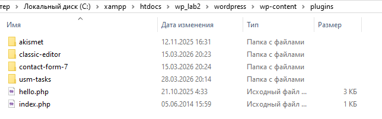

**Рисунок 2 — Содержимое папки usm-tasks: файлы usm-notes.php и style.css**

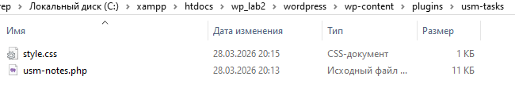

---

## 2. Инструкции по запуску проекта

### Требования к окружению

| Компонент | Минимальная версия |
|-----------|-------------------|
| PHP | 7.4 |
| WordPress | 5.8 |
| MySQL / MariaDB | 5.7 |
| XAMPP / OpenServer | любая актуальная |

### Шаг 1 — Подготовка среды

Убедитесь, что XAMPP запущен — модули **Apache** и **MySQL** активны.

WordPress доступен по адресу:
```
http://localhost:8080/wp_lab2/wordpress
```
Административная панель:
```
http://localhost:8080/wp_lab2/wordpress/wp-admin
```

### Шаг 2 — Включение режима отладки

Откройте `wp-config.php` и добавьте строки до `/* That's all, stop editing! */`:

```php
define( 'WP_DEBUG', true );
define( 'WP_DEBUG_LOG', true );
```

### Шаг 3 — Установка плагина

Скопируйте папку `usm-tasks/` в:
```
C:\xampp\htdocs\wp_lab2\wordpress\wp-content\plugins\usm-tasks\
```

Через Git:
```bash
cd C:\xampp\htdocs\wp_lab2\wordpress\wp-content\plugins\
git clone -b lab4 https://github.com/zabudico/university-labs.git temp_lab4
cp -r temp_lab4/lab4/usm-tasks ./usm-tasks
rm -rf temp_lab4
```

### Шаг 4 — Активация плагина

В административной панели перейдите в **Плагины → Установленные плагины**, найдите **USM Tasks** и нажмите **«Активировать»**.

После активации в левом меню появится раздел **«Задачи»** с подразделами «Все задачи», «Добавить задачу», «Приоритеты».

### Шаг 5 — Добавление терминов таксономии

Перейдите в **Задачи → Приоритеты** и добавьте три термина:

| Название | Slug |
|----------|------|
| High | high |
| Medium | medium |
| Low | low |

**Рисунок 3 — Таксономия «Приоритеты»: термины High, Medium, Low добавлены**

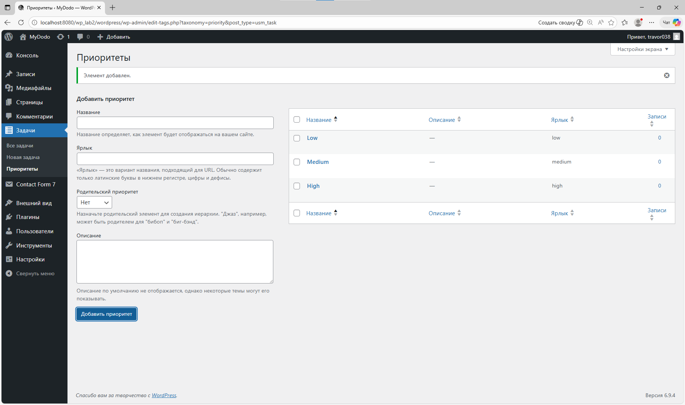

### Шаг 6 — Создание тестовых задач

Добавьте 5–6 задач через **Задачи → Добавить задачу**. Для каждой задачи укажите название, текст, приоритет и дату дедлайна в метабоксе.

**Рисунок 4 — Редактор новой задачи: заголовок, текст, метабокс с датой, приоритет High**

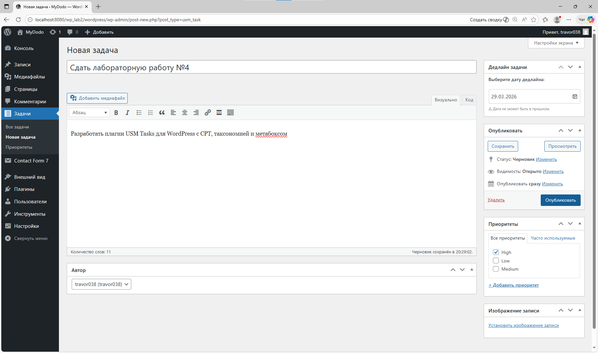

**Рисунок 5 — Редактор опубликованной задачи «Написать отчёт по лаб. №4»**

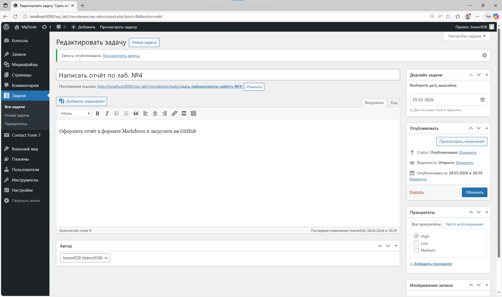

---

## 3. Краткая документация к плагину

### 3.1 Заголовок плагина

```php
<?php
/**
 * Plugin Name: USM Tasks
 * Plugin URI:  https://github.com/zabudico/university-labs
 * Description: Плагин для управления задачами с приоритетами и дедлайном.
 * Version:     1.0.0
 * Author:      Zabudico Alexandr
 * License:     GPL2
 * Text Domain: usm-tasks
 */

if ( ! defined( 'ABSPATH' ) ) {
    exit; // Запрет прямого доступа к файлу
}
```

---

### 3.2 Custom Post Type — «Задачи»

Регистрируется через хук `init` функцией `register_post_type()`.

**Ключевые параметры CPT:**

| Параметр | Значение | Назначение |
|----------|----------|------------|
| `public` | `true` | Тип виден на фронтенде и в поиске |
| `has_archive` | `true` | Архивная страница `/tasks/` |
| `supports` | `['title','editor','author','thumbnail']` | Поля редактора |
| `menu_icon` | `'dashicons-list-view'` | Иконка в меню админки |
| `show_in_rest` | `true` | Поддержка Gutenberg и REST API |
| `rewrite` | `['slug' => 'tasks']` | Чистый URL `/tasks/` |

**Код регистрации:**

```php
function usm_register_tasks_cpt() {
    $labels = [
        'name'               => 'Задачи',
        'singular_name'      => 'Задача',
        'add_new'            => 'Добавить задачу',
        'add_new_item'       => 'Новая задача',
        'edit_item'          => 'Редактировать задачу',
        'all_items'          => 'Все задачи',
        'not_found'          => 'Задачи не найдены',
        'not_found_in_trash' => 'В корзине задач нет',
    ];

    register_post_type( 'usm_task', [
        'labels'       => $labels,
        'public'       => true,
        'has_archive'  => true,
        'supports'     => [ 'title', 'editor', 'author', 'thumbnail' ],
        'menu_icon'    => 'dashicons-list-view',
        'show_in_rest' => true,
        'rewrite'      => [ 'slug' => 'tasks' ],
    ] );
}
add_action( 'init', 'usm_register_tasks_cpt' );
```

---

### 3.3 Пользовательская таксономия — «Приоритет»

Регистрируется через `register_taxonomy()`, привязывается к CPT `usm_task`.

**Ключевые параметры:**

| Параметр | Значение | Назначение |
|----------|----------|------------|
| `hierarchical` | `true` | Работает как категории |
| `public` | `true` | Видна на фронтенде |
| `show_in_rest` | `true` | Поддержка блочного редактора |
| `rewrite` | `['slug' => 'priority']` | URL `/priority/high/` |

**Код регистрации:**

```php
function usm_register_priority_taxonomy() {
    $labels = [
        'name'          => 'Приоритеты',
        'singular_name' => 'Приоритет',
        'all_items'     => 'Все приоритеты',
        'add_new_item'  => 'Добавить приоритет',
        'not_found'     => 'Приоритеты не найдены',
    ];

    register_taxonomy( 'priority', 'usm_task', [
        'labels'       => $labels,
        'hierarchical' => true,
        'public'       => true,
        'show_in_rest' => true,
        'rewrite'      => [ 'slug' => 'priority' ],
    ] );
}
add_action( 'init', 'usm_register_priority_taxonomy' );
```

---

### 3.4 Метабокс — «Дедлайн задачи»

**Регистрация метабокса:**

```php
function usm_add_deadline_metabox() {
    add_meta_box(
        'usm_deadline',
        'Дедлайн задачи',
        'usm_deadline_callback',
        'usm_task',
        'side',
        'high'
    );
}
add_action( 'add_meta_boxes', 'usm_add_deadline_metabox' );
```

**HTML-форма с nonce и атрибутом `min`:**

```php
function usm_deadline_callback( $post ) {
    wp_nonce_field( 'usm_save_deadline', 'usm_deadline_nonce' );
    $value = get_post_meta( $post->ID, '_usm_deadline', true );
    $today = date( 'Y-m-d' );
    echo '<input type="date" name="usm_deadline"
          value="' . esc_attr( $value ) . '"
          min="' . esc_attr( $today ) . '"
          required style="width:100%">';
    echo '<p style="color:#888;font-size:0.82em;">⚠ Дата не может быть в прошлом.</p>';
}
```

**Сохранение с полной цепочкой проверок:**

```php
function usm_save_deadline( $post_id ) {
    if ( defined( 'DOING_AUTOSAVE' ) && DOING_AUTOSAVE ) return;
    if ( ! isset( $_POST['usm_deadline_nonce'] ) ) return;
    if ( ! wp_verify_nonce( $_POST['usm_deadline_nonce'], 'usm_save_deadline' ) ) return;
    if ( ! current_user_can( 'edit_post', $post_id ) ) return;

    $date = sanitize_text_field( $_POST['usm_deadline'] ?? '' );

    if ( ! empty( $date ) && $date < date( 'Y-m-d' ) ) {
        set_transient( 'usm_deadline_error_' . $post_id,
            '⛔ Дедлайн не может быть в прошлом!', 45 );
        return;
    }
    $date
        ? update_post_meta( $post_id, '_usm_deadline', $date )
        : delete_post_meta( $post_id, '_usm_deadline' );
}
add_action( 'save_post', 'usm_save_deadline' );
```

**Рисунок 6 — Редактор задачи: метабокс «Дедлайн задачи» с корректной датой**

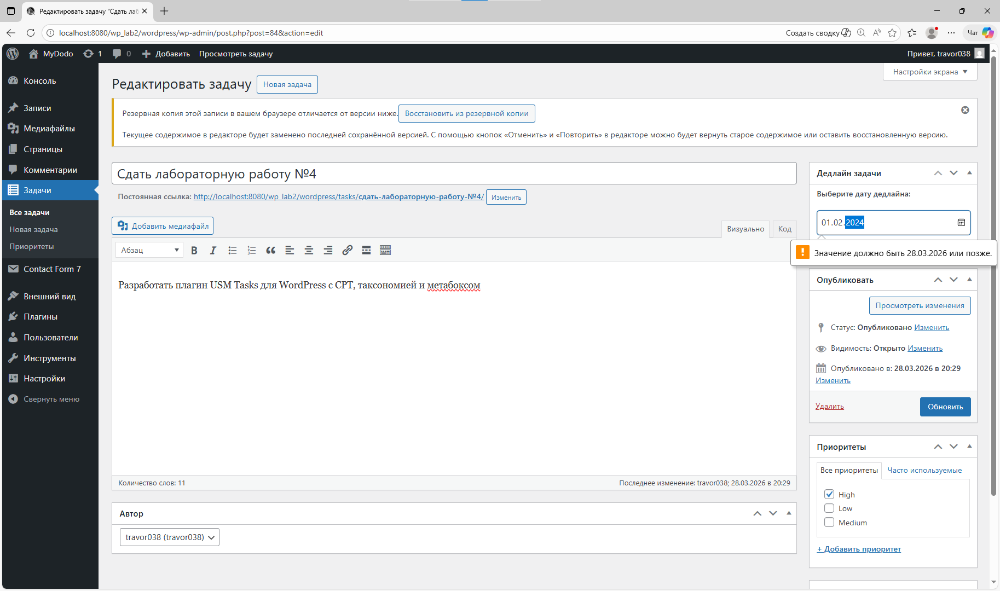

**Рисунок 7 — Валидация: браузер блокирует ввод даты в прошлом**

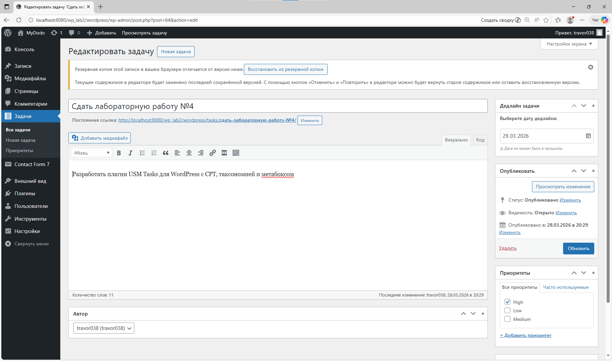

**Особенность реализации:** колонка «Дедлайн» в списке задач показывает даты с цветовой индикацией — зелёный для актуальных, красный для просроченных.

```php
function usm_show_deadline_column( $column, $post_id ) {
    if ( $column === 'deadline' ) {
        $date  = get_post_meta( $post_id, '_usm_deadline', true );
        $past  = $date && $date < date( 'Y-m-d' );
        $color = $past ? 'color:#e74c3c;' : 'color:#27ae60;';
        echo $date
            ? '<span style="' . $color . 'font-weight:600;">' . esc_html( $date ) . '</span>'
              . ( $past ? ' <span style="color:#e74c3c;">(просрочено)</span>' : '' )
            : '<span style="color:#aaa;">—</span>';
    }
}
```

**Рисунок 8 — Список задач в админке: колонка «Дедлайн» с зелёными датами**

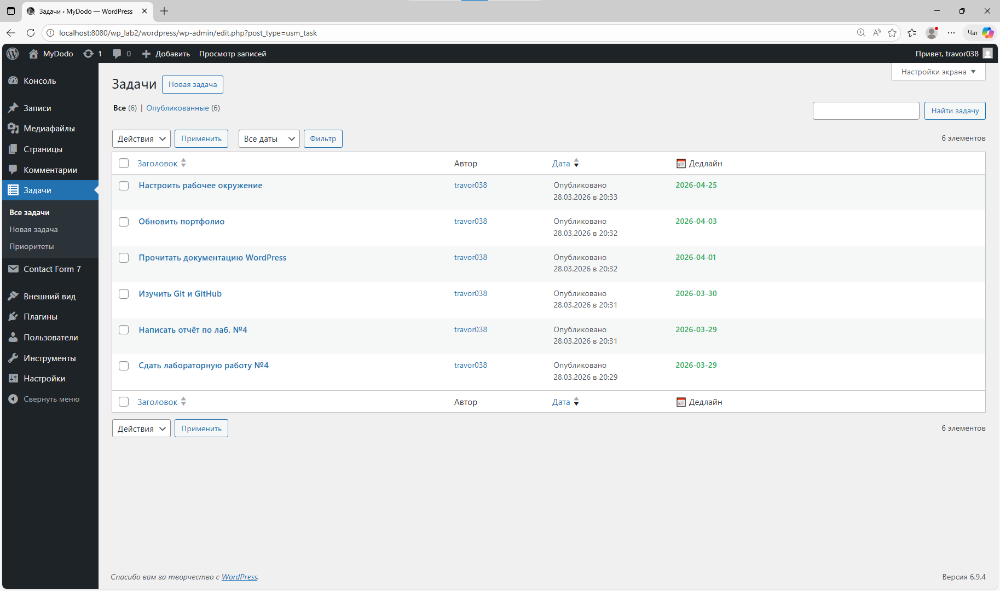

---

### 3.5 Шорткод `[usm_tasks]`

**Параметры шорткода:**

| Атрибут | Тип | По умолчанию | Описание |
|---------|-----|-------------|----------|
| `priority` | string | `''` (все) | Фильтр по slug приоритета |
| `before_date` | string | `''` (все) | Задачи с дедлайном ≤ указанной даты |

**Логика работы:**
1. Без атрибутов — выводятся все задачи, отсортированные по дедлайну
2. `priority` — добавляется `tax_query` по таксономии
3. `before_date` — добавляется `meta_query` по метаполю `_usm_deadline`
4. Нет совпадений — выводится «Нет задач с заданными параметрами»
5. Просроченные задачи помечаются меткой «просрочено»

---

### 3.6 Файл `style.css` — описание стилей

| Класс | Описание |
|-------|----------|
| `.usm-tasks-list` | Контейнер списка задач |
| `.usm-task` | Карточка задачи |
| `.usm-task.usm-overdue` | Просроченная задача (красный фон) |
| `.usm-priority-high/medium/low` | Цвет левой полоски |
| `.usm-badge-high/medium/low` | Цвет бейджа приоритета |
| `.usm-overdue-label` | Красная метка «просрочено» |
| `.usm-empty` | Сообщение при отсутствии задач |

---

## 4. Примеры использования плагина

### 4.1 Страница «All Tasks» — редактор

На странице размещены три шорткода для демонстрации всех возможностей фильтрации.

**Рисунок 9 — Редактор страницы «All Tasks» с тремя шорткодами**

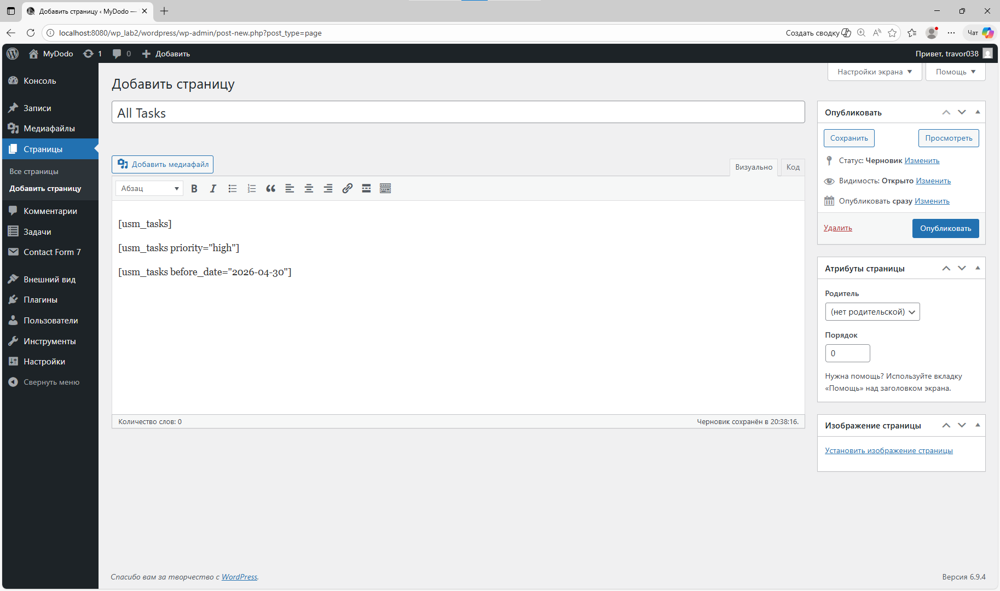

---

### 4.2 Шорткод `[usm_tasks]` — все задачи

```
[usm_tasks]
```

Выводит все опубликованные задачи, отсортированные по дедлайну.

**Рисунок 10 — Фронтенд: все задачи (начало страницы — High и Medium)**

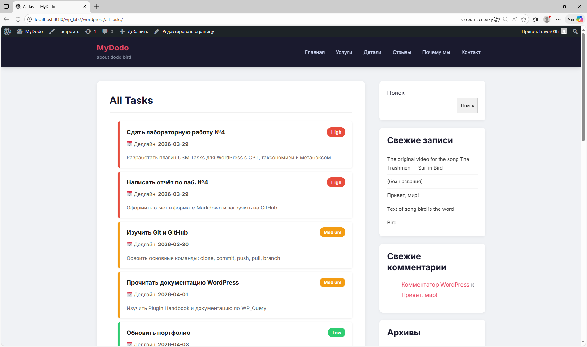

**Рисунок 11 — Фронтенд: все задачи (продолжение — Medium и Low задачи)**

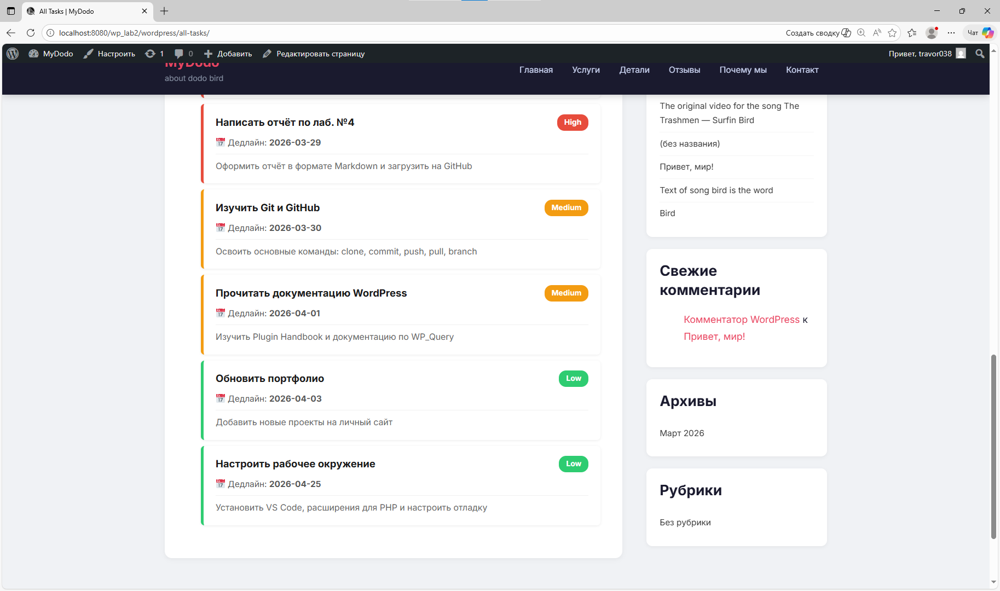

---

### 4.3 Шорткод `[usm_tasks priority="high"]` — фильтр по приоритету

```
[usm_tasks priority="high"]
```

Показывает только задачи с приоритетом **High**.

**Рисунок 12 — Фронтенд: шорткод `[usm_tasks priority="high"]` — только срочные задачи**

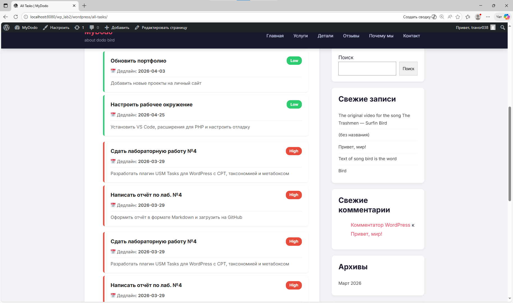

---

### 4.4 Шорткод `[usm_tasks before_date="2026-04-30"]` — фильтр по дате

```
[usm_tasks before_date="2026-04-30"]
```

Показывает задачи с дедлайном не позже 30 апреля 2026.

**Рисунок 13 — Фронтенд: шорткод `[usm_tasks before_date="2026-04-30"]`**

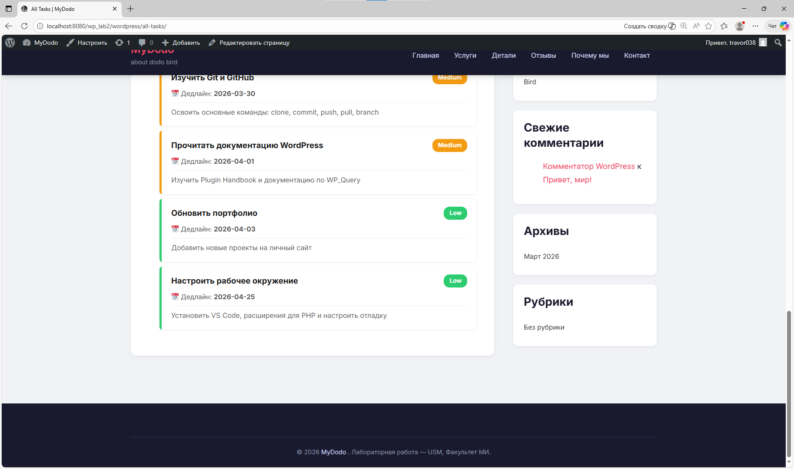

---

### 4.5 Поведение при отсутствии задач

Если ни одна задача не удовлетворяет фильтру — выводится сообщение.

**Рисунок 14 — Фронтенд: сообщение «Нет задач с заданными параметрами»**

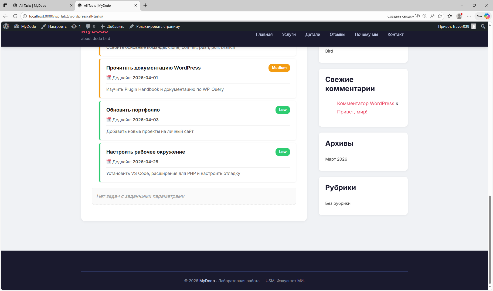

---

### 4.6 Комбинированный фильтр

```
[usm_tasks priority="high" before_date="2026-03-31"]
```

Только срочные задачи с дедлайном до конца марта 2026.

---

## 5. Ответы на контрольные вопросы

### Вопрос 1. Чем пользовательская таксономия принципиально отличается от метаполя?

**Таксономия** — механизм **классификации** записей по общим категориям. Термины существуют независимо от записей и могут использоваться многократно. WordPress хранит их в отдельных таблицах: `wp_terms`, `wp_term_taxonomy`, `wp_term_relationships`. Поддерживают архивные страницы, навигацию, фильтрацию через `tax_query`.

**Метаполе** — произвольные данные, привязанные к **конкретной записи**. Хранятся в `wp_postmeta` в виде пары ключ-значение. Подходит для уникальных данных каждой записи.

**Сравнительная таблица:**

| Критерий | Таксономия | Метаполе |
|----------|-----------|----------|
| Хранение | `wp_terms` + связующие таблицы | `wp_postmeta` |
| Значения | Общие для многих записей | Уникальные для каждой |
| Фильтрация | `tax_query` | `meta_query` |
| Архивные страницы | ✅ `/priority/high/` | ❌ |
| Переиспользование | ✅ | ❌ |

**Когда выбрать таксономию:** когда значение повторяется у многих записей и нужна фильтрация. В плагине — **приоритет задачи** (High/Medium/Low): один приоритет имеют несколько задач, нужна страница `/priority/high/`.

**Когда выбрать метаполе:** когда данные уникальны для каждой записи. В плагине — **дедлайн** (`_usm_deadline`): у каждой задачи своя дата, нет смысла делать её термином таксономии.

---

### Вопрос 2. Зачем нужен nonce при сохранении метаполей и что произойдёт, если его не проверять?

**Nonce** (number used once) — одноразовый токен безопасности, привязанный к действию, пользователю и времени (действителен 24 часа).

**Механизм в плагине:**

```php
// В форме — генерируем токен
wp_nonce_field( 'usm_save_deadline', 'usm_deadline_nonce' );

// При сохранении — проверяем
if ( ! wp_verify_nonce( $_POST['usm_deadline_nonce'], 'usm_save_deadline' ) ) {
    return; // Запрос нелегитимен — прерываем
}
```

**Что произойдёт без проверки nonce:**

1. **CSRF-атака:** злоумышленник создаёт страницу с формой, отправляющей POST-запрос к сайту. Браузер автоматически прикрепляет cookies сессии администратора — WordPress принимает запрос как легитимный и изменяет данные без ведома пользователя.

2. **Срабатывание при автосохранении:** без nonce `save_post` выполняется при каждом автосохранении, что может перезаписать данные в неожиданный момент.

3. **Массовые действия:** операции в списке записей тоже вызывают `save_post` — без nonce это затронет поле дедлайна у всех задач.

Дополнительная защита — проверка прав:
```php
if ( ! current_user_can( 'edit_post', $post_id ) ) return;
```

---

### Вопрос 3. Какие аргументы register_post_type() и register_taxonomy() важны для фронтенда и UX?

**1. `public => true`** — делает CPT и таксономию видимыми на фронтенде. Без этого записи недоступны по прямым ссылкам, не индексируются поиском, шорткод не работает для посетителей.

**2. `has_archive => true`** — создаёт архивную страницу `/tasks/` со всеми записями. Важен для UX: пользователи могут просмотреть все задачи по одному URL без дополнительного кода. Улучшает SEO.

**3. `show_in_rest => true`** — включает REST API и поддержку Gutenberg. Без этого: блочный редактор недоступен для CPT, сторонние приложения не видят записи через API.

**4. `rewrite => ['slug' => 'tasks']`** — задаёт читаемый URL. Без него WordPress использует технический идентификатор: `/usm_task/my-task/` вместо `/tasks/my-task/`. Чистые URL улучшают восприятие и SEO.

**5. `labels`** — определяет названия всех элементов интерфейса: меню, кнопок, сообщений. Без корректных labels интерфейс отображает технические идентификаторы, что затрудняет работу администратора.

---

## 6. Список использованных источников

1. WordPress Developer Documentation — register_post_type():  
   https://developer.wordpress.org/reference/functions/register_post_type/

2. WordPress Developer Documentation — register_taxonomy():  
   https://developer.wordpress.org/reference/functions/register_taxonomy/

3. WordPress Developer Documentation — add_meta_box():  
   https://developer.wordpress.org/reference/functions/add_meta_box/

4. WordPress Developer Documentation — wp_nonce_field() и wp_verify_nonce():  
   https://developer.wordpress.org/reference/functions/wp_nonce_field/

5. WordPress Developer Documentation — WP_Query (tax_query, meta_query):  
   https://developer.wordpress.org/reference/classes/wp_query/

6. WordPress Developer Documentation — add_shortcode():  
   https://developer.wordpress.org/reference/functions/add_shortcode/

7. WordPress Developer Documentation — update_post_meta() / get_post_meta():  
   https://developer.wordpress.org/reference/functions/update_post_meta/

8. WordPress Plugin Handbook — Plugin Security:  
   https://developer.wordpress.org/plugins/security/

9. WordPress Plugin Handbook — Custom Post Types:  
   https://developer.wordpress.org/plugins/post-types/

10. WordPress Plugin Handbook — Taxonomies:  
    https://developer.wordpress.org/plugins/taxonomies/

11. MDN Web Docs — HTML input type="date":  
    https://developer.mozilla.org/en-US/docs/Web/HTML/Element/input/date

12. WordPress Codex — Dashicons:  
    https://developer.wordpress.org/resource/dashicons/

---

*Все исходные файлы плагина доступны в репозитории:  
`https://github.com/zabudico/university-labs/tree/lab4`*
