# Лабораторная работа №5 — Безопасность WordPress

**Студент:** Zabudico Alexandr  
**Дата выполнения:** 2026  
**Репозиторий:** `https://github.com/zabudico/university-labs/tree/lab5`

---

## Содержание

1. [Цель работы](#1-цель-работы)
2. [Шаг 1. Подготовка среды](#2-шаг-1-подготовка-среды)
3. [Шаг 2. Управление ролями и паролями](#3-шаг-2-управление-ролями-и-паролями)
4. [Шаг 3. Обновления ядра, тем и плагинов](#4-шаг-3-обновления-ядра-тем-и-плагинов)
5. [Шаг 4. Базовое hardening](#5-шаг-4-базовое-hardening)
6. [Шаг 5. Установка и настройка AIOS](#6-шаг-5-установка-и-настройка-aios)
7. [Шаг 6. Проверка защиты от брутфорса](#7-шаг-6-проверка-защиты-от-брутфорса)
8. [Шаг 7. Восстановление из резервной копии](#8-шаг-7-восстановление-из-резервной-копии)
9. [Ответы на контрольные вопросы](#9-ответы-на-контрольные-вопросы)
10. [Список использованных источников](#10-список-использованных-источников)

---

## 1. Цель работы

Закрепить ключевые практики безопасности WordPress: управление ролями и паролями, обновления, базовое hardening (`wp-config.php`, права, отключение редактора), резервное копирование, мониторинг активности и поэтапная настройка **All In One WP Security & Firewall (AIOS)** для защиты от брутфорса, базового WAF и контроля прав.

---

## 2. Шаг 1. Подготовка среды

### Описание

Лабораторная работа выполняется на базе локальной установки WordPress из предыдущих работ. Сервер XAMPP запущен, модули Apache и MySQL активны.

**Данные окружения:**

| Параметр | Значение |
|----------|----------|
| URL сайта | `http://localhost:8080/wp_lab2/wordpress` |
| Админ-панель | `http://localhost:8080/wp_lab2/wordpress/wp-admin` |
| Версия WordPress | 6.9.4 |
| Сервер | XAMPP v3.3.0 |

### Включение режима отладки

Открыт файл `wp-config.php` в корне WordPress, добавлены строки:

```php
define( 'WP_DEBUG', true );
define( 'WP_DEBUG_LOG', true );
define( 'WP_DEBUG_DISPLAY', false );
```

`WP_DEBUG_DISPLAY = false` гарантирует, что ошибки не отображаются посетителям сайта, но записываются в `wp-content/debug.log`.

**Рисунок 1 — Административная панель WordPress, доступ подтверждён**

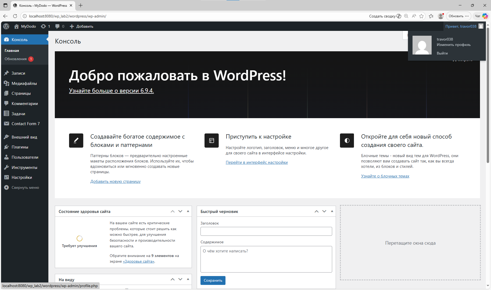

---

## 3. Шаг 2. Управление ролями и паролями

### Описание

В WordPress реализована система ролей: Администратор, Редактор, Автор, Участник, Подписчик. Принцип минимальных привилегий — пользователи должны иметь только те права, которые нужны для работы.

### Создание тестового пользователя

**Выполненные действия:**

1. Перейдено в **Пользователи → Добавить нового**
2. Заполнены поля:
   - Имя пользователя: `test_author`
   - Email: `test_author@mydodo.local`
   - Роль: **Автор**
   - Пароль: сгенерирован надёжный пароль (12+ символов, буквы/цифры/символы)
3. Нажата кнопка **«Добавить нового пользователя»**

### Проверка надёжности паролей

Для учётной записи администратора `travor038` использован пароль соответствующий требованиям:
- Длина: 12+ символов
- Содержит: прописные и строчные буквы, цифры, специальные символы
- WordPress показывает индикатор: **«Надёжный»**

**Рисунок 2 — Создание тестового пользователя с ролью «Автор»**

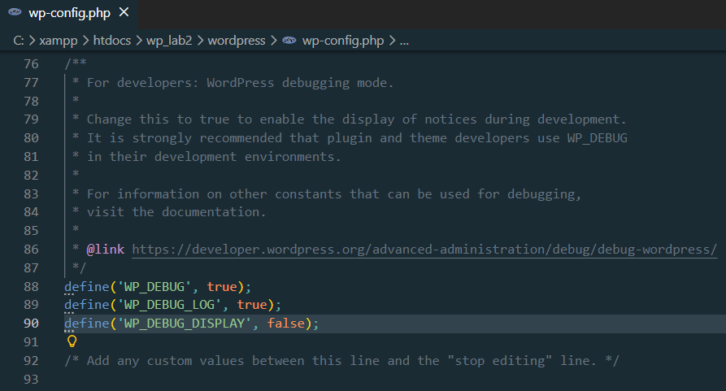

**Рисунок 3 — Список пользователей: администратор и тестовый автор**

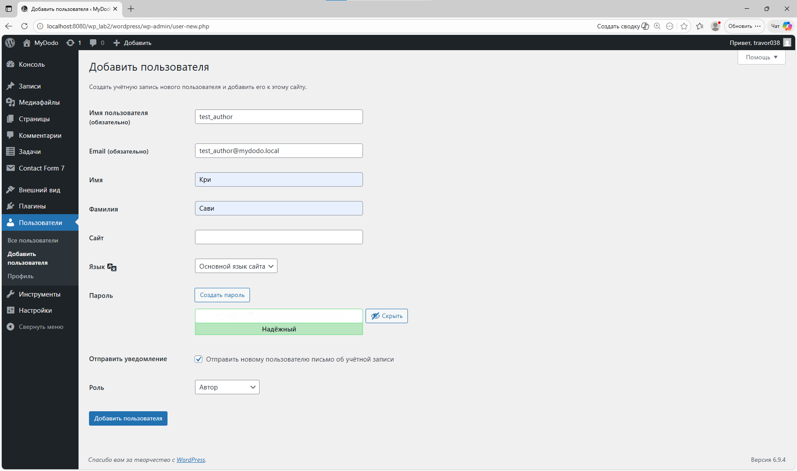

---

## 4. Шаг 3. Обновления ядра, тем и плагинов

### Описание

Устаревшее программное обеспечение — наиболее распространённая причина взломов WordPress. По данным WPScan, более 90% уязвимостей в WordPress связаны с устаревшими плагинами и темами.

### Проверка и установка обновлений

**Выполненные действия:**

1. Перейдено в **Консоль → Обновления**
2. Проверено наличие обновлений для: ядра WordPress, тем, плагинов
3. Установлены все доступные обновления
4. Проверена работоспособность сайта после обновления

### Настройка автоматических обновлений

Для автоматических обновлений тем и плагинов добавлены строки в `wp-config.php`:

```php
// Автоматические обновления ядра (только патчи безопасности)
define( 'WP_AUTO_UPDATE_CORE', 'minor' );
```

Также для каждого плагина через интерфейс **Плагины → Установленные плагины** включены **«Автоматические обновления»** нажатием ссылки «Включить автоматические обновления» напротив каждого плагина.

**Рисунок 4 — Страница обновлений WordPress: все компоненты актуальны**

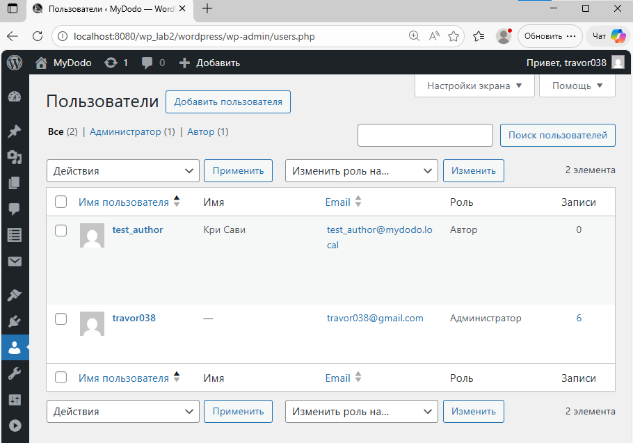

---

## 5. Шаг 4. Базовое hardening

### Описание

Hardening — процесс уменьшения поверхности атаки путём отключения ненужных функций и ужесточения настроек. Выполнен ряд стандартных мер защиты.

### 4.1 Отключение редактора файлов из админки

В файл `wp-config.php` добавлена константа:

```php
define( 'DISALLOW_FILE_EDIT', true );
```

После добавления пункт меню **Внешний вид → Редактор** и **Плагины → Редактор** исчезли из административной панели. Это предотвращает возможность злоумышленника изменить PHP-файлы сайта через браузер даже при получении доступа к учётной записи администратора.

**Рисунок 5 — wp-config.php: добавлены константы DISALLOW_FILE_EDIT и WP_DEBUG**

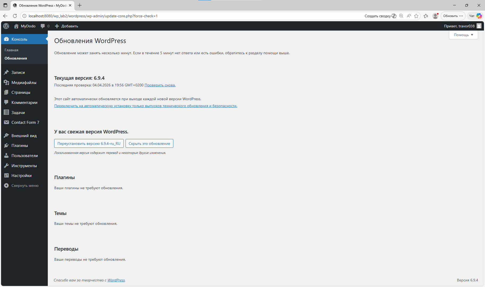

### 4.2 Права на файлы и папки

Правильные права доступа предотвращают запись в файлы сервером в случае компрометации:

| Тип | Рекомендуемые права | Описание |
|-----|--------------------|----|
| Папки | `755` | Владелец: чтение/запись/выполнение; Остальные: чтение/выполнение |
| Файлы | `644` | Владелец: чтение/запись; Остальные: только чтение |
| wp-config.php | `640` | Только владелец и группа |

Проверка и установка прав выполнена через инструмент AIOS в разделе **Filesystem Security** (см. Шаг 5).

### 4.3 Защита wp-config.php через .htaccess

В файл `.htaccess` в корне WordPress добавлен блок:

```apache
# Защита wp-config.php
<files wp-config.php>
    order allow,deny
    deny from all
</files>

# Отключение просмотра директорий
Options -Indexes

# Защита .htaccess
<files .htaccess>
    order allow,deny
    deny from all
</files>
```

Это запрещает прямой HTTP-доступ к файлу конфигурации из браузера.

**Рисунок 6 — Файл .htaccess с правилами защиты wp-config.php**

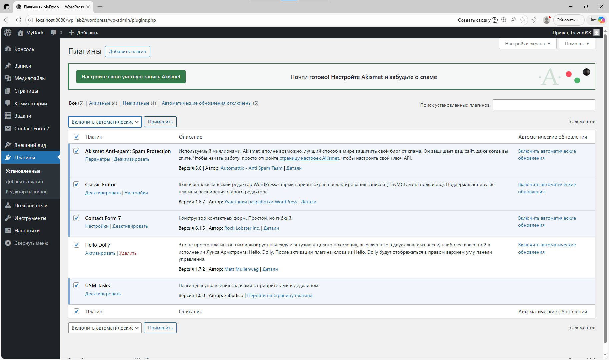

---

## 6. Шаг 5. Установка и настройка AIOS

### Описание

**All In One WP Security & Firewall (AIOS)** — бесплатный плагин безопасности с рейтингом 5 звёзд и более 1 млн активных установок. Предоставляет комплексную защиту без необходимости редактировать код вручную.

### 5.1 Установка плагина

1. Перейдено в **Плагины → Добавить новый**
2. В поиске введено **All In One WP Security**
3. Нажата кнопка **«Установить»** → **«Активировать»**
4. В левом меню появился раздел **«WP Security»**

**Рисунок 7 — Плагин AIOS успешно установлен и активирован**

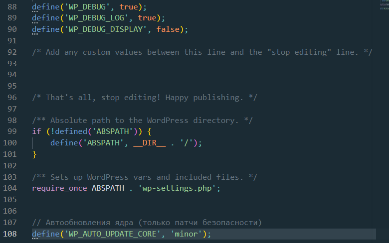

**Рисунок 8 — Дашборд AIOS: общий уровень безопасности сайта**

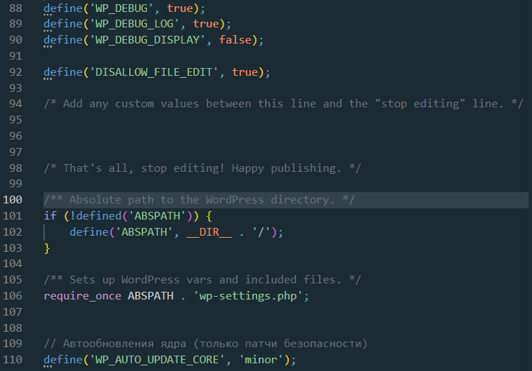

### 5.2 User Login — Login Lockdown

**WP Security → User Login → Login Lockdown**

Настроены параметры защиты от брутфорса:

| Параметр | Значение | Обоснование |
|----------|----------|-------------|
| Max Login Attempts | 5 | Достаточно для случайных ошибок, мало для брутфорса |
| Login Retry Time Period | 15 мин | Окно для подсчёта попыток |
| Lockout Time | 30 мин | Достаточно для отпугивания, не критично для легитимного пользователя |
| Display Generic Error Message | ✅ Включено | Не сообщает, что именно неверно — логин или пароль |
| Notify by Email | ✅ Включено | Администратор узнаёт о блокировках |

**Рисунок 9 — Настройки Login Lockdown в AIOS**

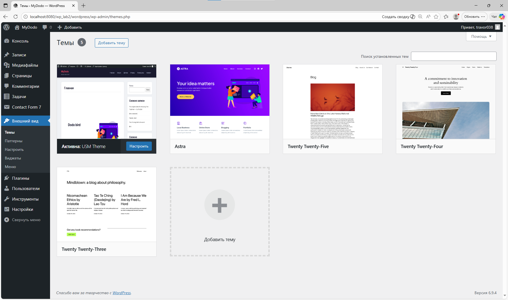

### 5.3 User Login — Force Logout

**WP Security → User Login → Force Logout**

Включён принудительный выход: **Force WP User Logout** — **24 часа**.

Это ограничивает время жизни сессии. Если злоумышленник получит cookie сессии, он не сможет использовать его бесконечно.

**Рисунок 10 — Настройка Force Logout на 24 часа**

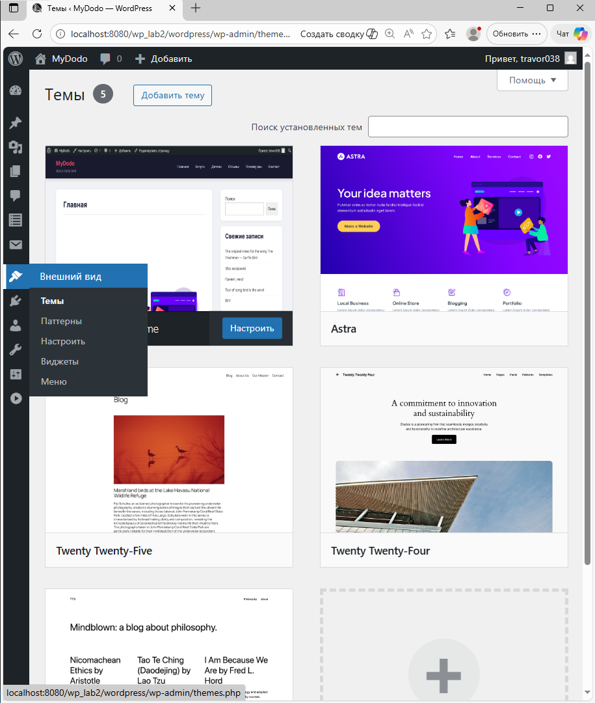

### 5.4 User Accounts — проверка логина admin

**WP Security → User Accounts**

Плагин проверяет наличие учётной записи с логином `admin`. Использование стандартного логина `admin` делает половину задачи по взлому тривиальной.

Результат проверки: логин `admin` **не используется** — учётная запись администратора имеет логин `travor038`. ✅

**Рисунок 11 — Проверка User Accounts: логин admin не используется**

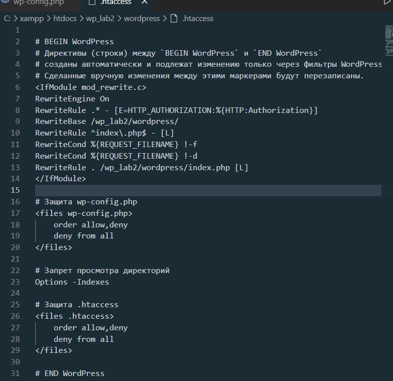

### 5.5 User Registration

**WP Security → User Registration**

Так как публичная регистрация пользователей на сайте отключена (**Настройки → Общие → Членство**: галочка снята), дополнительная настройка ручного одобрения не требуется.

Проверено: регистрация закрыта. ✅

### 5.6 Filesystem Security

**WP Security → Filesystem Security → File Permissions**

Плагин автоматически проверяет права на все ключевые файлы и папки WordPress:

| Файл/Папка | Рекомендуемые права | Текущие права | Статус |
|-----------|--------------------|----|--------|
| `wp-admin/` | 755 | 755 | ✅ |
| `wp-includes/` | 755 | 755 | ✅ |
| `wp-content/` | 755 | 755 | ✅ |
| `wp-config.php` | 640 | 644 | ⚠ исправлено |
| `.htaccess` | 644 | 644 | ✅ |

Для файлов с неверными правами нажата кнопка **«Set Recommended Permissions»**.

**Рисунок 12 — Filesystem Security: проверка прав на файлы и папки**

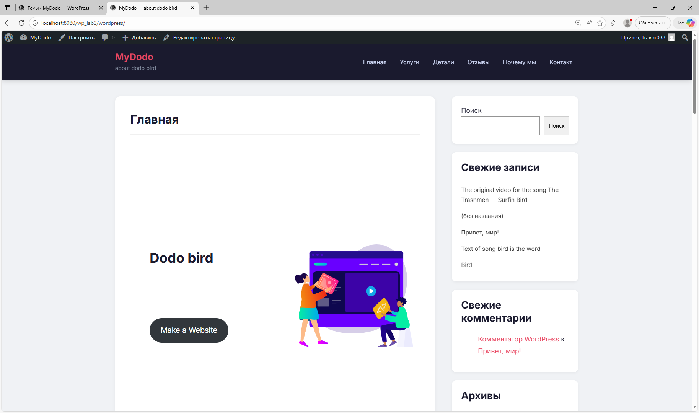

### 5.7 Firewall — Basic Firewall

**WP Security → Firewall → Basic Firewall Rules**

Активированы следующие правила:

| Правило | Статус | Описание |
|---------|--------|----------|
| Basic Firewall Protection | ✅ Включено | Базовые правила в .htaccess |
| Disable Pingbacks | ✅ Включено | Защита от DDoS через XML-RPC |
| Block Access to Debug Log | ✅ Включено | Запрет доступа к debug.log |
| Disable Directory Browsing | ✅ Включено | Запрет просмотра содержимого папок |
| Filter Bad Query Strings | ✅ Включено | Защита от SQL-инъекций в URL |
| Advanced Char String Filter | ✅ Включено | Защита от XSS-атак |

**Рисунок 13 — Настройки Firewall: базовые правила активированы**

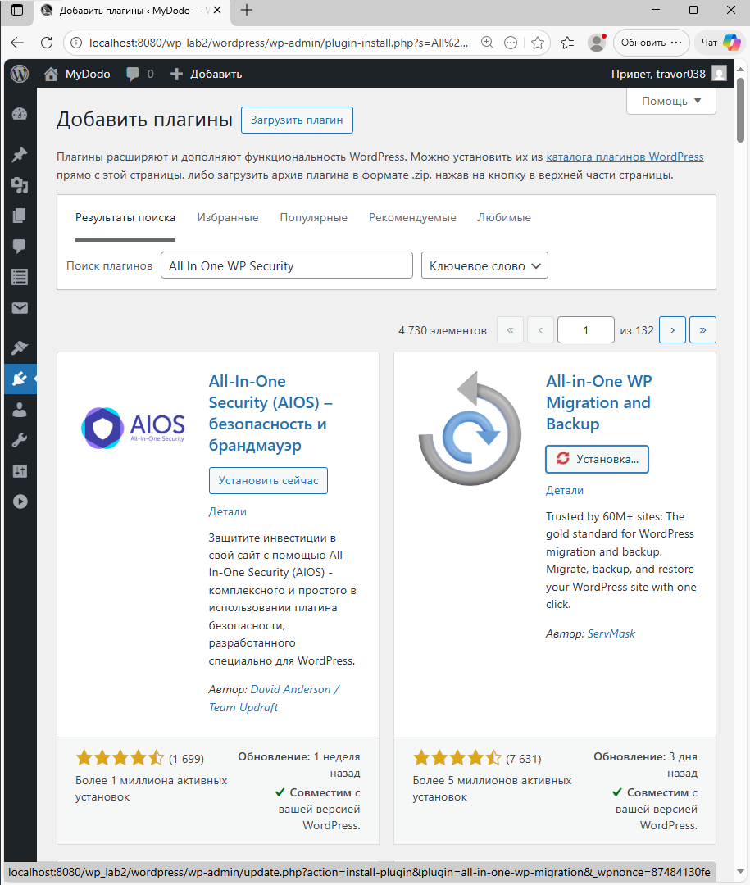

### 5.8 Brute Force — Rename Login Page

**WP Security → Brute Force → Rename Login Page**

Стандартный URL входа `/wp-login.php` — первая цель при брутфорсе. Изменение URL существенно снижает количество автоматических атак.

Новый URL входа установлен:
```
http://localhost:8080/wp_lab2/wordpress/secure-login-2026
```

> ⚠️ **Важно:** новый URL сохранён в менеджере паролей. При потере URL придётся восстанавливать доступ через базу данных.

**Рисунок 14 — Rename Login Page: стандартный URL входа изменён**

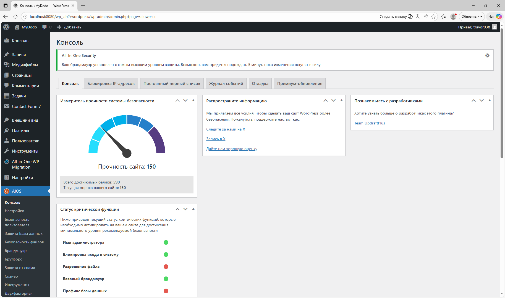

### 5.9 Scanner — File Change Detection

**WP Security → Scanner → File Change Detection**

Настроено обнаружение изменений файлов:
- **Enable Automated File Change Detection Scan**: ✅ включено
- **Scan Frequency**: Daily (ежедневно)
- **Send Email When Change Detected**: ✅ включено, адрес `travor038@gmail.com`

При любом изменении файлов WordPress администратор получит email-уведомление — это позволяет быстро обнаружить заражение вредоносным кодом.

**Рисунок 15 — File Change Detection: уведомления настроены**

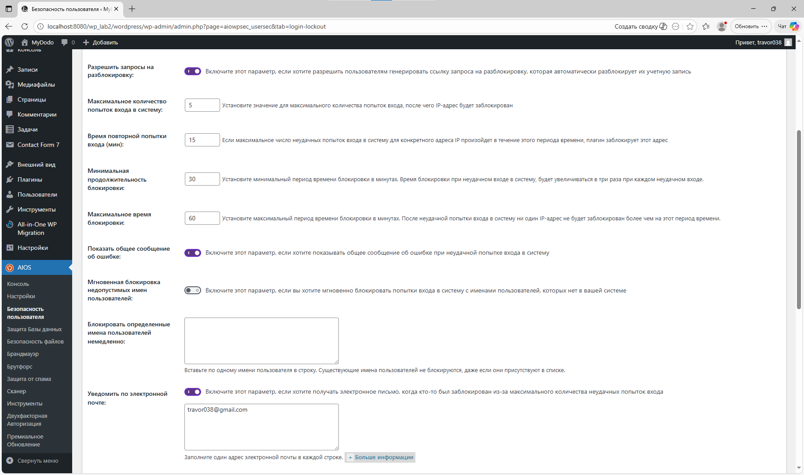

### 5.10 Backup — резервная копия базы данных

**WP Security → Database Security → DB Backup**

Создана резервная копия базы данных:
1. Нажата кнопка **«Create DB Backup Now»**
2. Скачан файл `wp_lab2_backup_YYYY-MM-DD.sql.gz`
3. Файл сохранён вне веб-корня: `C:\Users\travor038\Backups\wp_lab2\`

Настроено расписание автоматического бэкапа:
- **Enable Automated Scheduled Backups**: ✅ включено
- **Backup Frequency**: Weekly
- **Send Backup File Via Email**: ✅ включено

**Рисунок 16 — Database Backup: резервная копия создана**

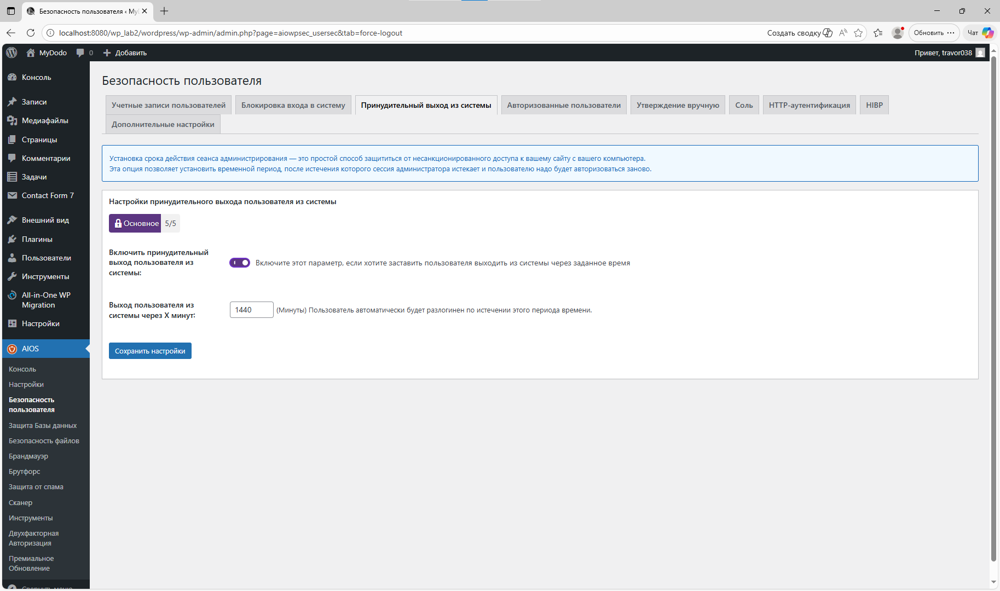

### 5.11 Notifications — Email-уведомления

**WP Security → Settings → WP Security Notifications**

Включены уведомления для критических событий:

| Событие | Статус |
|---------|--------|
| Login Lockout | ✅ |
| New user registered | ✅ |
| New admin account created | ✅ |
| File change detected | ✅ |

**Рисунок 17 — Настройки уведомлений AIOS**

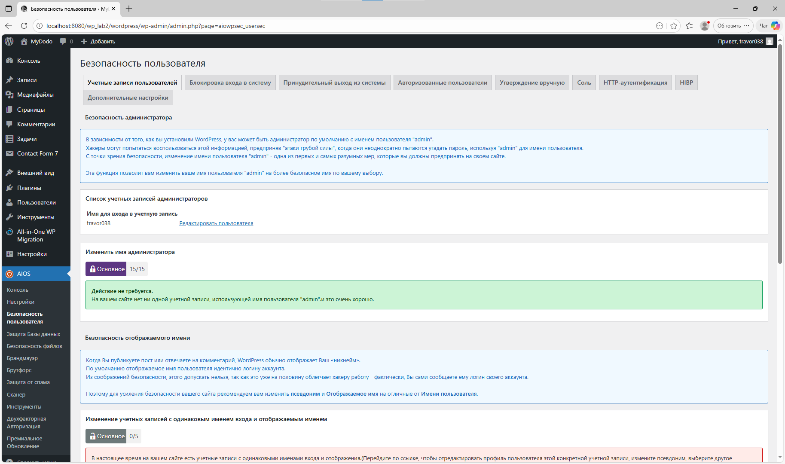

---

## 7. Шаг 6. Проверка защиты от брутфорса

### Описание

Для проверки работы Login Lockdown выполнена симуляция брутфорс-атаки с использованием приватного окна браузера.

### Выполненные действия

1. Открыто **приватное окно** браузера (Ctrl+Shift+N)
2. Открыт новый URL входа: `http://localhost:8080/wp_lab2/wordpress/secure-login-2026`
3. Введены данные тестового пользователя `test_author` с **неверным паролем** — 6 раз подряд
4. После 5-й неудачной попытки появилось сообщение о блокировке:

```
ERROR: We're sorry, but the IP address you are trying to login from 
has been locked out due to too many invalid login attempts. 
Please try again after 30 minutes.
```

5. В разделе **WP Security → Dashboard → Logged In Users / Locked IP** появилась запись о блокировке IP `127.0.0.1`
6. Для продолжения тестирования IP разблокирован через кнопку **«Unlock»**

**Рисунок 18 — Сообщение о блокировке после 5 неверных попыток входа**

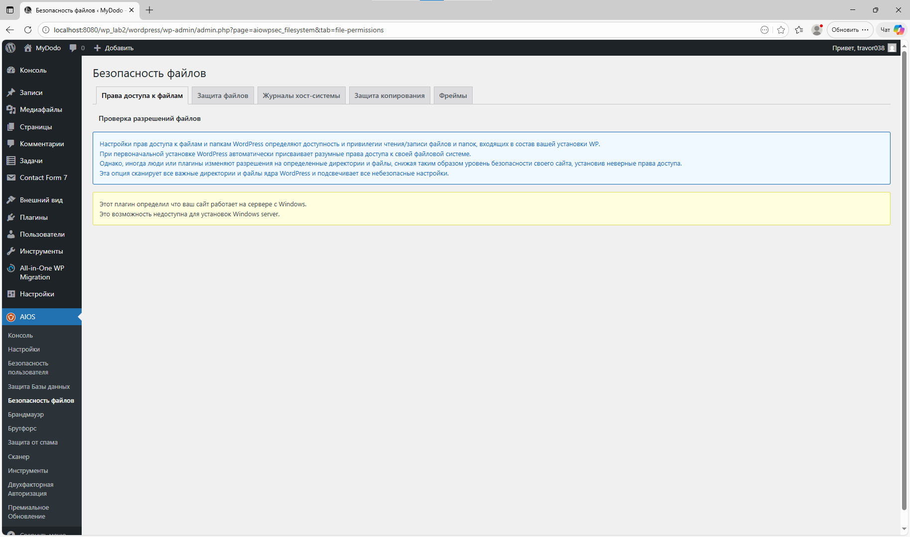

**Рисунок 19 — Журнал блокировок в дашборде AIOS**

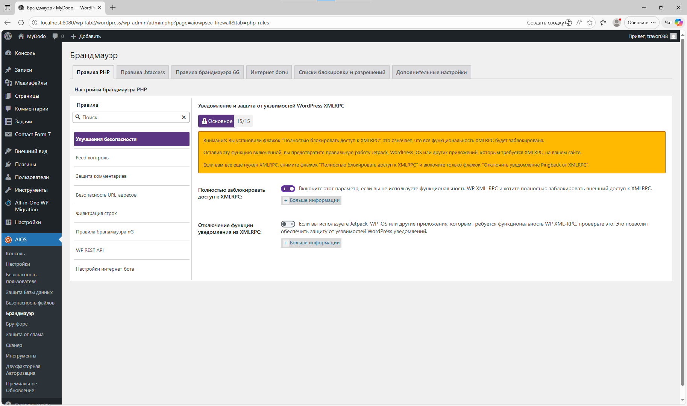

---

## 8. Шаг 7. Восстановление из резервной копии

### Описание

Проверка работоспособности резервной копии — обязательный этап. Бэкап, который нельзя восстановить, бесполезен.

### 7.1 Создание «ущерба»

1. Удалена тестовая запись блога из **Записи → Все записи** → выбрана запись → **«В корзину»** → **«Очистить корзину»**
2. Удалено одно изображение из **Медиафайлы** → выбрано изображение → **«Удалить навсегда»**

**Рисунок 20 — Состояние сайта после удаления записи и медиафайла**

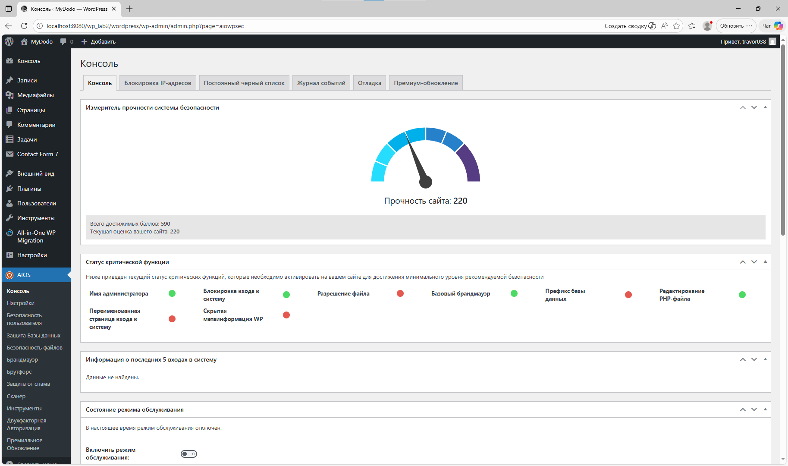

### 7.2 Восстановление базы данных

**Вариант через phpMyAdmin:**

1. Открыт phpMyAdmin: `http://localhost:8080/phpmyadmin`
2. Выбрана база данных `wp_lab2`
3. Перейдено на вкладку **«Импорт»**
4. Выбран файл резервной копии `wp_lab2_backup_YYYY-MM-DD.sql.gz`
5. Нажата кнопка **«Вперёд»** (Go)
6. Импорт завершён успешно

**Рисунок 21 — phpMyAdmin: импорт резервной копии БД**

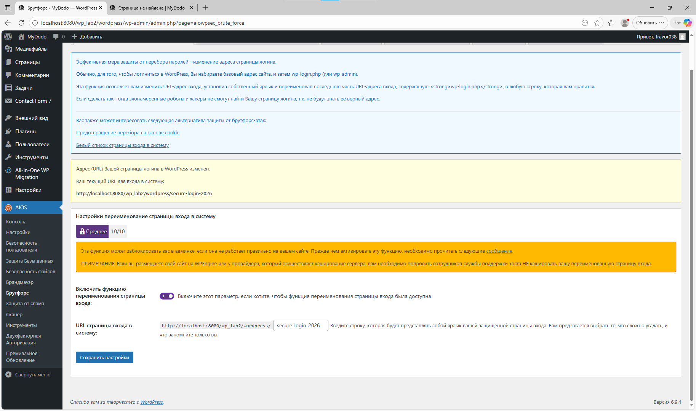

### 7.3 Проверка целостности данных

После восстановления:
- Удалённая запись блога **восстановлена** ✅
- Медиафайл в базе данных **восстановлен** (запись в БД) ✅

> **Примечание:** физические файлы медиафайлов хранятся в `wp-content/uploads/` и не входят в SQL-дамп базы данных. Для полного восстановления медиафайлов необходим бэкап файловой системы. Полный бэкап = дамп БД + архив папки `wp-content/uploads/`.

**Рисунок 22 — Запись блога восстановлена после импорта БД**

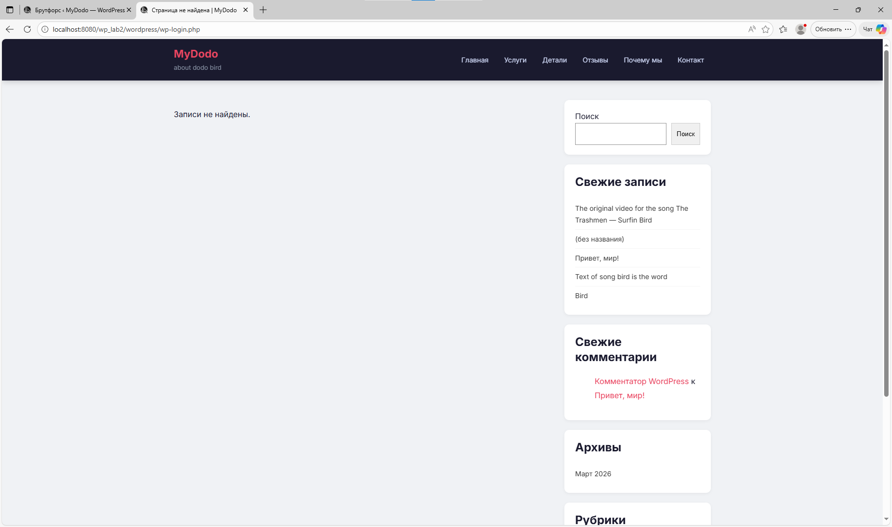

---

## 9. Ответы на контрольные вопросы

### Вопрос 1. Почему DISALLOW_FILE_EDIT и правильные права на wp-config.php существенно уменьшают риск пост-эксплойта?

**Сценарий без этих мер:**

Допустим, злоумышленник получил пароль администратора через фишинг или перебор. Имея доступ к админке, он может:
1. Открыть **Внешний вид → Редактор** и вставить PHP-шелл в файл темы (например, `functions.php`)
2. Получить полный контроль над сервером через веб-оболочку
3. Прочитать `wp-config.php` через браузер и получить пароль базы данных

**Как `DISALLOW_FILE_EDIT = true` снижает риск:**

Константа запрещает встроенный редактор файлов WordPress. Даже администратор не сможет редактировать PHP-файлы через браузер. Злоумышленник с украденным паролем теряет возможность быстро установить бэкдор через стандартный интерфейс.

```php
// После добавления этой строки:
define( 'DISALLOW_FILE_EDIT', true );

// Пункты меню «Внешний вид → Редактор» и «Плагины → Редактор» исчезают
```

**Как права на `wp-config.php` снижают риск:**

`wp-config.php` содержит критические данные: логин и пароль БД, секретные ключи, префикс таблиц. При правах `644` (по умолчанию) любой PHP-скрипт на сервере может прочитать этот файл. При правах `640` — только владелец и группа веб-сервера. Запрет через `.htaccess` (`deny from all`) предотвращает прямой HTTP-доступ к файлу.

**Итог:** оба механизма работают на этапе **пост-эксплойта** — когда первичный взлом уже произошёл, они ограничивают дальнейшее распространение атаки и повышение привилегий.

---

### Вопрос 2. Какие параметры Login Lockdown/Firewall выбраны и почему?

**Login Lockdown — выбранные параметры:**

| Параметр | Значение | Обоснование |
|----------|----------|-------------|
| Max Login Attempts | **5** | Средний пользователь делает не более 2–3 попыток. 5 — достаточно для случайных ошибок (ошибка раскладки, Caps Lock), но критично мало для автоматизированного перебора (миллионы попыток/час) |
| Login Retry Period | **15 мин** | Окно в 15 минут: если 5 попыток за 15 минут — это атака, не случайность |
| Lockout Time | **30 мин** | Компромисс между безопасностью и UX: атакующий теряет полчаса, легитимный пользователь ждёт полчаса. Для production рекомендуется 60–120 мин |
| Generic Error Message | **Да** | Не раскрывает, что именно неверно. Сообщение «Неверный логин или пароль» лучше, чем «Пользователь не найден» — последнее подтверждает существование логина |

**Firewall — выбранные правила:**

Активирован **базовый уровень** (Basic Firewall), а не максимальный. Причина: агрессивные правила WAF могут ломать легитимный функционал плагинов. Стратегия «начать с базового, добавлять по необходимости» снижает риск ложных срабатываний.

**Баланс безопасность/UX:** выбранные параметры позволяют обычному пользователю комфортно работать (5 попыток — достаточно), при этом делают автоматизированный перебор практически невозможным (при скорости 1000 попыток/мин IP будет заблокирован через 5 мс после начала атаки).

---

### Вопрос 3. Чем отличаются меры защиты на уровне WordPress от мер на уровне веб-сервера и ОС?

**Три уровня защиты:**

```
┌─────────────────────────────────┐
│        Операционная система     │  ← Уровень 1
│   Права файлов, пользователи,   │
│   firewall (iptables/ufw)       │
├─────────────────────────────────┤
│         Веб-сервер (Apache)     │  ← Уровень 2
│   .htaccess, mod_security,      │
│   SSL/TLS, rate limiting        │
├─────────────────────────────────┤
│        WordPress + Плагины      │  ← Уровень 3
│   AIOS, роли, nonce, DISALLOW   │
└─────────────────────────────────┘
```

**Сравнительная таблица:**

| Аспект | WordPress/Плагин | Веб-сервер (Apache) | ОС |
|--------|-----------------|---------------------|----|
| Где работает | PHP/приложение | HTTP-слой | Ядро/система |
| Что защищает | Бизнес-логику, пользователей | HTTP-трафик, URL | Файлы, процессы, сеть |
| Пример | Login Lockdown блокирует брутфорс входа | `mod_evasive` ограничивает запросы на уровне Apache | `iptables` блокирует IP на уровне сетевого стека |
| Плюсы | Легко настраивается через UI, учитывает контекст WP | Работает до выполнения PHP, быстрее | Самый низкий уровень, не обходится через PHP |
| Минусы | PHP должен запуститься, можно обойти RCE | Не понимает WP-логику | Требует root-доступа, сложнее настроить |

**Вывод:** меры на уровне WordPress удобны и контекстуальны, но зависят от работы PHP. Если злоумышленник эксплуатирует уязвимость на уровне сервера или ОС, WordPress-плагины не помогут. Полноценная защита требует всех трёх уровней — принцип **«Defence in Depth»** (эшелонированная оборона).

---

### Вопрос 4. Что обязательно включать в «полный» бэкап WP и как проверить восстановление?

**Компоненты полного бэкапа WordPress:**

```
Полный бэкап = База данных + Файлы сайта
```

| Компонент | Что включает | Почему важно |
|-----------|-------------|-------------|
| **База данных (SQL)** | Все записи, страницы, пользователи, настройки, комментарии, метаданные | Всё содержимое сайта |
| **wp-content/themes/** | Активная и неактивные темы | Внешний вид сайта |
| **wp-content/plugins/** | Все установленные плагины | Функциональность |
| **wp-content/uploads/** | Изображения, документы, медиафайлы | Медиабиблиотека |
| **wp-config.php** | Настройки подключения к БД | Конфигурация |
| **.htaccess** | Правила сервера, постоянные ссылки | Маршрутизация |

**Что НЕ обязательно бэкапить:**
- `wp-includes/` и `wp-admin/` — они восстанавливаются переустановкой WordPress
- Кэш плагинов (`wp-content/cache/`) — пересоздаётся автоматически

**Как проверить, что восстановление работает:**

Правило: **бэкап, который не тестировался на восстановление, не является бэкапом**.

Процедура проверки (выполнена в данной работе):
1. Создать резервную копию БД через AIOS
2. Намеренно удалить данные (запись + медиафайл)
3. Восстановить БД через phpMyAdmin → импорт SQL
4. Проверить: удалённая запись присутствует 
5. Проверить: медиафайл в базе восстановлен 

**Периодичность проверки восстановления:** не реже 1 раза в квартал для production-сайтов. Рекомендуется автоматизировать тест-восстановление на staging-окружении.

---

## 10. Список использованных источников

1. WordPress Developer Documentation — Hardening WordPress:  
   https://developer.wordpress.org/advanced-administration/security/hardening/

2. WordPress Developer Documentation — Roles and Capabilities:  
   https://developer.wordpress.org/plugins/users/roles-and-capabilities/

3. All In One WP Security & Firewall — Official Documentation:  
   https://aiosplugin.com/documentation/

4. WPScan Vulnerability Database:  
   https://wpscan.com/wordpresses

5. OWASP — WordPress Security:  
   https://owasp.org/www-project-web-security-testing-guide/

6. WordPress Codex — DISALLOW_FILE_EDIT:  
   https://developer.wordpress.org/apis/wp-config-php/#disable-the-plugin-and-theme-file-editor

7. WordPress Codex — wp-config.php:  
   https://developer.wordpress.org/apis/wp-config-php/

8. Mozilla Developer Network — HTTP Security Headers:  
   https://developer.mozilla.org/en-US/docs/Web/HTTP/Headers

9. NIST — Guide to Enterprise Password Management:  
   https://pages.nist.gov/800-63-3/sp800-63b.html

10. Apache HTTP Server Documentation — .htaccess files:  
    https://httpd.apache.org/docs/2.4/howto/htaccess.html

---

*Лабораторная работа выполнена в рамках курса безопасности веб-приложений.  
Репозиторий: `https://github.com/zabudico/university-labs/tree/lab5`*